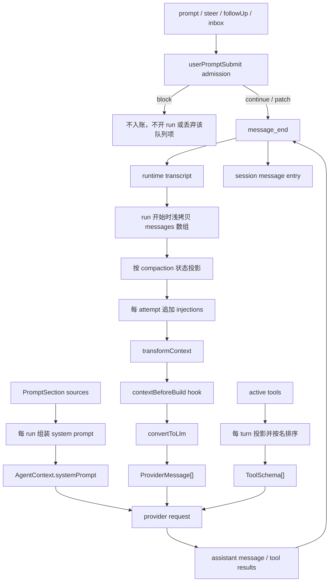

# 上下文与消息流

> 读者：修改消息投影、上下文扩展点或会话恢复的人<br>
> 范围：transcript、working context、provider context 的数据流、所有权与失败语义<br>
> 状态：当前实现说明；对象别名、入站验形与来源字段的限制见 §10

## 导读

**解决什么。** 区分会话中发生的事实与临时送给模型的工作材料，明确哪些变更进入账本，哪些只影响一次请求。

**设计主线。** AgentMessage 保存本地消息事实，session ledger 持久化这些事实；每个 attempt 从 transcript 的压缩视图构建 working context，加入动态材料并经过 transform、hook 和 projection，得到 provider context。system 单独按主 run 装配，工具按 turn 冻结。

**边界。** 本文不定义具体 provider 方言、界面渲染或记忆提取策略。对应设计见 [Prompt](prompt.md)、[Compaction](compaction.md) 和 [Memory](memory.md)。

## 术语与分层

> 规范词表在仓库根 [CONTEXT.md](../../CONTEXT.md)；本表只列本文用到的，定义以那里为准。

| 术语 | 本文含义 | 是否持久化 | 是否直接送模型 |
| --- | --- | --- | --- |
| transcript | 按入账顺序排列的 `AgentMessage[]`，是 Agent 对会话事实的运行时视图 | 是 | 否 |
| session ledger | 盘上的 message / compaction / error entries | 是 | 否 |
| system prompt | 一个 run 装配出的固定前缀 | 否，装备与来源数据另行持久化 | 是 |
| attempt injection | 当前模型调用临时追加的 instruction-like 消息；同一 turn 重试会重算 | 否 | 是 |
| working context | transcript 快照、injection 和 hook/transform 处理后的 `AgentMessage[]` | 否 | 否 |
| provider context | `systemPrompt + ProviderMessage[] + ToolSchema[]` | 否 | 是 |
| projection | `AgentMessage[] → ProviderMessage[]` 的单向转换 | 否 | 产物送模型 |
| compaction | 作用在 transcript 上的视图状态（哪些段被摘要 / 省略、旧工具结果清到哪），送模前投影；transcript 本身不动 | 状态持久化（session 的 compaction entry） | 投影后的上下文送模型 |

`AgentContext` 保存 `systemPrompt`、`messages` 与 `compaction`，工具故意每 turn 重取，见 [`AgentContext`](../../packages/core/src/loop/types.ts#symbol=AgentContext)。“context”在源码里有时指这个 Agent 层工作对象，有时指最终 provider 请求；本文使用完整层级名称区分这几个对象。

## 1. 当前数据流



输入准入见 [`Agent.admitUserMessages()`](../../packages/core/src/agent.ts#symbol=Agent.admitUserMessages)，run snapshot 见 [`Agent.createContextSnapshot()`](../../packages/core/src/agent.ts#symbol=Agent.createContextSnapshot)，turn 内顺序见 [`runTurn()`](../../packages/core/src/loop/run-turn.ts#symbol=runTurn)。

这条流水线里有两个正交通道：

- **prompt 通道**决定模型此刻看见什么：system、injections、transform、hook、projection、tools。
- **ledger 通道**决定什么成为会话事实：`message_end`、compaction entry、error entry。

一项数据可以只走其中一条。skill 正文 injection 只走 prompt 通道；工具 metadata 只走 ledger 通道；普通 user / assistant 消息先入账，再由 projection 进入 prompt 通道。两条通道当前仍共享部分消息对象，所有权限制见 §4。

## 2. 消息账本

### 2.1 四种内建角色

| 角色 | 表示的事实 | 缺省投影 |
| --- | --- | --- |
| `user` | 人类、steer 或 harness 放入的输入 | provider `user`，剥掉 `at/source` |
| `assistant` | provider 的权威定稿、stop reason、usage 与 model 来源 | provider `assistant`，剥掉账本字段；空 content 隐形 |
| `toolResult` | 某个工具调用的结果及本地 metadata | provider `user` 中的 `tool_result`；metadata 不出门 |
| `environment` | 后台任务、定时器、webhook 等外部事实 | provider `user`，剥掉 `source/ref` |

形状定义与投影见 [`AgentMessage`](../../packages/core/src/messages.ts#symbol=AgentMessage) 和 [`defaultConvertToLlm`](../../packages/core/src/messages.ts#symbol=defaultConvertToLlm)。自定义 role 缺省只进入 transcript 与 session，不送模型；这是忘记实现 projection 时的安全缺省。

toolResult 与 environment 在账本中保留独立角色，provider 的角色限制只在投影时处理。相邻工具结果只在 projection 时合并，也保留了逐条审计能力。已有判据见 [toolResult 投影与相邻合并](../../packages/core/test/invariants.test.ts#test=投影toolresult-包回-user-角色的-toolresult-块相邻的合并成一条)。

### 2.2 消息来源与入站通道

`UserMessage.source` 只有 `human | steer | harness`，见 [`UserMessage`](../../packages/core/src/messages.ts#symbol=UserMessage)。`Agent.followUp("next")` 用 `userMessage(..., "human")` 建消息，见 [`Agent.followUp()`](../../packages/core/src/agent.ts#symbol=Agent.followUp)；之后 `userPromptSubmit` hook 单独收到 `source: "followUp"`，但 admission 不会修正消息本身。

来源字段当前不能单独区分初始 prompt 和 followUp；后者的入站通道另在 hook 中表达。使用它做 UI 或评测归因时，应先区分内容作者与入站通道，不把 hook 的来源枚举当成消息的来源枚举。

### 2.3 消息验形

[`assertMessageShape()`](../../packages/core/src/message-shape.ts#symbol=assertMessageShape) 会闭合校验内建 role 和 content block，但它用于 session 恢复与 inbox 接收；[`normalizePrompt()`](../../packages/core/src/agent.ts#symbol=normalizePrompt) 对对象和数组原样返回。TypeScript 调用方通常会在编译期被挡住，JavaScript、`any`、反序列化输入和自定义宿主不会。

因此恢复期拒绝坏消息，不代表程序化 prompt 入站已经具备同等校验。JavaScript 调用方和反序列化入口需要在提交前验证内建消息形状；补齐所有 durable ingress 的统一验形仍是实现限制。恢复校验继续负责发现旧数据或外部坏写。

## 3. Prompt 通过两条通道进入 context

prompt 的内容、所有权、排序、变量、信任、失败与预算只有一份权威说明：[Prompt 设计](prompt.md)。本文只保留它与消息流水线相交的两条事实：

- system sections 在主 Agent 的 run 开始前装配成 `AgentContext.systemPrompt`；该快照不进入 transcript。
- 动态 injection 在每个 attempt 构建 working context 时追加到压缩视图末尾，不发 `message_end`，因此不进入 transcript 或 session；工具门控读取本 turn 冻结的菜单。

随后 injection 与 transcript 一起经过 `transformContext → contextBeforeBuild → convertToLlm`。工具 schema 由同一 turn 的工作集单独投影，不从 prompt module 生成。接线见 [`Agent.createContextSnapshot()`](../../packages/core/src/agent.ts#symbol=Agent.createContextSnapshot) 与 [`runAttempt()`](../../packages/core/src/loop/run-turn.ts#symbol=runAttempt)。

## 4. Working context 与对象所有权

### 4.1 现在只有数组快照，没有消息快照

`Agent.createContextSnapshot()` 使用 `[...this._state.messages]`，只复制最外层数组。`processEvents(message_end)` 也把事件里的原对象追加进 `_state.messages`；`Agent.state` 只浅拷贝 state 对象，`Agent.messages` 直接返回同一个消息数组的 readonly 类型视图。见 [`Agent.createContextSnapshot()`](../../packages/core/src/agent.ts#symbol=Agent.createContextSnapshot)、[`Agent.processEvents()`](../../packages/core/src/agent.ts#symbol=Agent.processEvents) 和 [`Agent.state`](../../packages/core/src/agent.ts#symbol=Agent.state)。

readonly 是类型约束，不是运行时隔离。调用方修改原消息，或 transform 原地修改嵌套字段，可能同时改变内存 transcript，却没有相应的新 session entry。不要在这些接口上原地修改共享消息；历史复核探针见 [归档](../code-review/2026-09-15-doc-probes.md)。

### 4.2 所有权要求与实现边界

要让“transcript 是事实账本”成立，最低判据应是：

1. 外部消息在 admission 时验形并取得所有权；之后修改调用方原对象不影响 transcript。
2. `state`、`messages`、event listener 和 hook 获得的只读视图不能原地改写账本。
3. `transformContext` 与 `contextBeforeBuild` 操作独立 working copy；它们可以增删改送模材料，但不能回写 transcript。
4. 同一条 `message_end` 在运行时投影与 session ledger 中具有相同的不可变值。

实现可以选择 ingress 时 `structuredClone + deepFreeze`，也可以采用内部不可变消息和 copy-on-write；这些是隔离目标，不是当前实现已提供的保证；性能策略与实现选择需在补齐边界时决定。

## 5. Projection：账本到 provider 消息

缺省 projection 做四件事：

- 去掉本地字段：时间、来源、usage、error、model、metadata、environment ref；
- 把 `toolResult` 变回 provider `user` 消息里的 `tool_result` block；
- 合并相邻的纯 tool-result provider messages；
- 对未知自定义 role、空 assistant 和失败的 assistant 消息不生成 provider 消息。

实现见 [`defaultConvertToLlm`](../../packages/core/src/messages.ts#symbol=defaultConvertToLlm)。它每个 attempt 从 working context 重算，产物不持久化；provider 方言和模型切换通过投影处理。

但“投影绝不回写”当前只对缺省实现自己的代码成立，不对可替换的 `Agent.convertToLlm` 成立。它收到的仍是与 transcript 共享嵌套对象的数组。正式契约应把输入定义为不可变 working copy，并把返回值验到 provider context 所需的最小形状；否则第三方 converter 可以同时破坏账本并产出坏线上协议。

## 6. contextBeforeBuild 的阻断语义

contextBeforeBuild 支持 continue / block / patch，见 [INTERCEPTABLE](../../packages/core/src/hooks/runtime.ts#symbol=INTERCEPTABLE)。block 阻止当前 attempt 调用 provider，runAttempt 返回 blocked，turn / reply 向外返回 aborted 并保留 reason；不合成一条模型没有说过的 assistant 消息。

这是主动阻断，不是运行错误。判据见 [block 不调模型](../../packages/core/test/prompt.test.ts#test=contextbeforebuild-返回-block不调模型run-以-aborted-收场reason-透传transcript-不多一条)。

## 7. Compaction 与恢复

压缩只改变送模视图，恢复从账本重建 transcript 与最后的 compaction 状态；完整机制见 [Compaction](compaction.md)。本数据流依赖以下判据：

| 判据 | 测试 |
| --- | --- |
| 触发后紧接着的 provider request 不含已覆盖原文、含摘要与尾巴 | [auto 触发](../../packages/core/test/compaction.test.ts#test=auto超阈值-轮首压缩-紧接着的-provider-请求只含摘要不含原文压完下一轮不重复压状态与-session-都记下) |
| 摘要带 harness 来源，不伪装成人或 assistant 原话 | [投影](../../packages/core/test/compaction.test.ts#test=投影段-一条-userharness清掉的-toolresult-换占位但-toolcallid-iserror-不动transcript-原对象一个字不改) |
| tool_use / tool_result 配对不被切断 | [切点](../../packages/core/test/compaction.test.ts#test=切点toolresult-前面不能切snapback-优先轮起点其次合法切点都没有回-min) |
| 压缩后立即续与恢复后续，下一次 provider context 逐字节相同 | [恢复一致](../../packages/core/test/compaction.test.ts#test=压缩后立即续跑-vs-重启恢复后续跑下一次送模消息逐字节相同) |
| 游标只有一种：transcript 下标，运行时与盘上同一套 | [session 恢复](../../packages/core/test/session-service.test.ts#test=不变量①-恢复后-messages-与-compaction-同源同一份-entries-投影出来取最后一次压缩的状态) |
| 压到预算内之后下一轮不重复摘要 | 同第一条 |

运行态分别用 compaction 表达视图状态、contextTokens 表达上下文占用。

## 8. 失败语义

prompt section、变量与 injection 的失败语义归 [Prompt 设计](prompt.md) §8。transform 和 converter 的调用异常当前导致 internal error，不使用自动回退；实现者须自行返回安全结果，不能依赖外层替换为原输入。

| 失败点 | 当前行为 | 注释或接口暗示 |
| --- | --- | --- |
| `transformContext()` 抛错 | run 以 internal error 结束 | “失败原样返回入参” |
| `convertToLlm()` 抛错 | run 以 internal error 结束 | “绝不抛” |
| `contextBeforeBuild` 返回 block | run 以 `aborted` 结束、reason 透传，provider 不被调用 | interceptable / block |

终止规范化保留结构化 outcome，但不把失败转成继续请求。注释中的“绝不抛”应理解为实现者的责任，不是外层提供回退的保证。

## 9. 哪些由机器守，哪些只是纪律

### 已有机器判据

| 性质 | 机器判据 |
| --- | --- |
| 缺省 projection 剥掉本地字段 | [账本字段不出门](../../packages/core/test/invariants.test.ts#test=投影剥壳atsourceusagemetadata-不出门) |
| tool result 在线上合并、账本中逐条保留 | [toolResult 投影与相邻合并](../../packages/core/test/invariants.test.ts#test=投影toolresult-包回-user-角色的-toolresult-块相邻的合并成一条) |
| 空 assistant 不进入 provider context | [空 assistant 隐形](../../packages/core/test/invariants.test.ts#test=投影空-content-的-assistant-消息整条隐形空消息是协议违规) |
| `contextBeforeBuild` block 不调 provider、run 以 aborted 收场 | [block 判据](../../packages/core/test/prompt.test.ts#test=contextbeforebuild-返回-block不调模型run-以-aborted-收场reason-透传transcript-不多一条) |
| session 恢复时拒绝坏内建消息 | [坏 message payload 恢复判红](../../packages/core/test/session-service.test.ts#test=坏-message-payload-在恢复时判红只有-role-是不够的)、[content block 闭合验形](../../packages/core/test/session-service.test.ts#test=内容块闭合验形缺字段与不认识的-type-都判红) |

prompt 自身的机器判据与缺口见 [Prompt 设计](prompt.md) §9–§10，不在这里抄第二份。

### 未覆盖的保证

只读类型不证明运行时所有权隔离；hook 来源测试不证明消息的 source 字段保留了入站通道。新增测试应分别断言这两件事，而不是用调用成功代替它们。

## 10. 当前限制

- 消息对象仍可能与调用方、transform 共享；不可把浅拷贝称为不可变快照。
- 程序化 prompt 的对象输入未统一经过恢复期的内建消息验形。
- source 表达内容来源，followUp 入站通道需结合 hook 或 reply 事件判断。
- transform / converter 抛错会终止 run；当前没有自动 fallback。
- 自定义 role 缺省不送模型，使用它的产品应同时提供需要的 projection。

这些限制影响账本完整性和调用方用法；实现方案不在本次文档整理中决定。

## 11. 验证

已有相关测试：

```bash
bun test packages/core/test/prompt.test.ts \
  packages/core/test/seams.test.ts \
  packages/core/test/invariants.test.ts \
  packages/core/test/session-service.test.ts \
  packages/core/test/intake.test.ts
```

测试结果应以当前执行为准；具名用例只证明其覆盖的输入和断言。历史探针见 [复核记录](../code-review/2026-09-15-doc-probes.md)。
