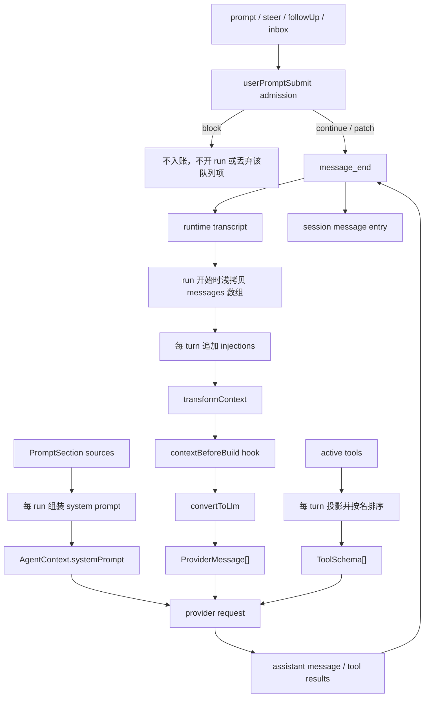

# Context 与 Message Flow（审阅稿）

> 状态：审阅中，尚未成为设计契约<br>
> 基线：2026-09-01 当前源码与测试<br>
> 范围：消息账本、system prompt、每轮注入、送模投影、上下文变换、压缩与会话恢复<br>
> 暂不处理：具体 provider 方言、thinking 字段的厂商兼容、Memory 的提取与写回策略、UI 如何展示消息<br>
> 退出条件：第 10 节每一项分别形成决策记录，结论吸收到正式设计后删除本稿；历史由 Git 保留

这份文档回答四个问题：什么是会话事实，什么只是本轮给模型看的工作材料，哪一步可以改写它们，以及长会话如何压缩和恢复。未经拍板的现状不会被写成目标设计。

## 结论先行

当前实现已经有一条值得保留的主轴：

- `AgentMessage` 是本地账本形状，`ProviderMessage` 是临时线上形状；两者不混存。
- system prompt 每个 run 装配一次，每轮动态内容作为 injection 追加，不进入 transcript。
- 工具结果、环境事件与人类输入在账本里角色分明，出门时再投影成 provider 支持的两种角色。
- 每条真正入账的消息都经 `message_end`，并由同一事件驱动运行时投影和 session append。

但是“账本是事实、context 是投影”这句话目前还不能成立为公开契约。源码里有七个必须先处理或明确接受的问题：

1. **compaction 只生成并持久化摘要，不替换送模上下文。** 超预算后 provider 仍收到全部原文；下一 turn 还会再次摘要同一批历史。
2. **消息没有所有权隔离。** `prompt(message)`、`Agent.messages`、context snapshot 与 `transformContext` 共享嵌套对象；调用方或 transform 能在没有新事件、没有新 session entry 的情况下改写已经入账的历史。
3. **`contextBeforeBuild` 的 block 是假能力。** hook runtime 返回 `block`，调用点却忽略 decision，模型仍然被调用。
4. **`followUp` 的来源只在 hook event 中如实，账本里仍记成 `human`。** 现有测试标题声称 transcript 来源如实，但没有断言消息的 `source`。
5. **`PromptSource.toolSchemas()` 是死接口。** 类型和注释声称每轮读取，实际工具菜单来自 `getTools() → toolSchemas()`，这个方法从未被调用。
6. **上下文扩展点的失败契约与实现相反。** 注释要求 `transformContext`、`convertToLlm` 和 turn injection “绝不抛、失败安全回退”；实际任一抛错都会让整个 run 以 internal error 结束。
7. **消息只在恢复时严格验形，prompt 入站不验。** 一个 JavaScript 调用方可以让 Agent 自己把坏消息写进 session，本次 run 成功，下一次恢复才判坏档。

前两项直接破坏长会话正确性和审计可信度，第三、第四、第五项是公开接口或测试声称的行为并不存在，后两项是失败发生位置与承诺不一致。它们都不是靠改文案可以解决的问题。

## 术语与分层

| 术语 | 本文含义 | 是否持久化 | 是否直接送模型 |
| --- | --- | --- | --- |
| transcript | 按入账顺序排列的 `AgentMessage[]`，是 Agent 对会话事实的运行时视图 | 是 | 否 |
| session ledger | 盘上的 message / compaction / error entries | 是 | 否 |
| system prompt | 一个 run 装配出的固定前缀 | 否，装备与来源数据另行持久化 | 是 |
| turn injection | 当前 turn 临时追加的 instruction-like 消息 | 否 | 是 |
| working context | transcript 快照、injection 和 hook/transform 处理后的 `AgentMessage[]` | 否 | 否 |
| provider context | `systemPrompt + ProviderMessage[] + ToolSchema[]` | 否 | 是 |
| projection | `AgentMessage[] → ProviderMessage[]` 的单向转换 | 否 | 产物送模型 |
| compaction | 用摘要替代已覆盖历史、使后续送模上下文真正缩短的过程 | 摘要与游标应持久化 | 替代后的上下文送模型 |

`AgentContext` 目前只含 `systemPrompt` 与 `messages`，工具故意每 turn 重取，见 [`AgentContext`](../../packages/core/src/loop/types.ts#symbol=AgentContext)。“context”在源码里有时指这个 Agent 层工作对象，有时指最终 provider 请求；正式文档应始终带上层级，避免把账本、工作副本和线上电报叫成同一个东西。

## 1. 当前数据流



输入准入见 [`Agent.admitUserMessages()`](../../packages/core/src/agent.ts#symbol=Agent.admitUserMessages)，run snapshot 见 [`Agent.createContextSnapshot()`](../../packages/core/src/agent.ts#symbol=Agent.createContextSnapshot)，turn 内顺序见 [`runTurn()`](../../packages/core/src/loop/run-turn.ts#symbol=runTurn)。

这条流水线里有两个正交通道：

- **prompt 通道**决定模型此刻看见什么：system、injections、transform、hook、projection、tools。
- **ledger 通道**决定什么成为会话事实：`message_end`、compaction entry、error entry。

一项数据可以只走其中一条。skill 正文 injection 只走 prompt 通道；工具 metadata 只走 ledger 通道；普通 user / assistant 消息先入账，再由 projection 进入 prompt 通道。这个区分是合理的，问题出在两条通道目前共享可变对象。

## 2. 消息账本

### 2.1 四种内建角色

| 角色 | 表示的事实 | 缺省投影 |
| --- | --- | --- |
| `user` | 人类、steer 或 harness 放入的输入 | provider `user`，剥掉 `at/source` |
| `assistant` | provider 的权威定稿、stop reason、usage 与 model 来源 | provider `assistant`，剥掉账本字段；空 content 隐形 |
| `toolResult` | 某个工具调用的结果及本地 metadata | provider `user` 中的 `tool_result`；metadata 不出门 |
| `environment` | 后台任务、定时器、webhook 等外部事实 | provider `user`，剥掉 `source/ref` |

形状定义与投影见 [`AgentMessage`](../../packages/core/src/messages.ts#symbol=AgentMessage) 和 [`defaultConvertToLlm`](../../packages/core/src/messages.ts#symbol=defaultConvertToLlm)。自定义 role 缺省只进入 transcript 与 session，不送模型；这是忘记实现 projection 时的安全缺省。

把 `toolResult` 和 `environment` 留作一等账本角色是正确的。provider 只有两种 role 是线上协议限制，不应该倒过来污染本地事实模型。相邻工具结果只在 projection 时合并，也保留了逐条审计能力。已有判据见 [toolResult 投影与相邻合并](../../packages/core/test/invariants.test.ts#test=投影toolresult-包回-user-角色的-toolresult-块相邻的合并成一条)。

### 2.2 来源字段没有覆盖所有入账路径

`UserMessage.source` 只有 `human | steer | harness`，见 [`UserMessage`](../../packages/core/src/messages.ts#symbol=UserMessage)。`Agent.followUp("next")` 用 `userMessage(..., "human")` 建消息，见 [`Agent.followUp()`](../../packages/core/src/agent.ts#symbol=Agent.followUp)；之后 `userPromptSubmit` hook 单独收到 `source: "followUp"`，但 admission 不会修正消息本身。

复现：

```bash
bun -e 'import { Agent } from "./packages/core/src/agent.ts"; import { FAKE_MODEL, scriptedStreamFn, textTurn } from "./packages/core/src/testing.ts"; const a=new Agent({model:FAKE_MODEL,streamFunction:scriptedStreamFn([textTurn("one"),textTurn("two")])}); a.subscribe(async e=>{if(e.type==="agent_start") await a.followUp("next")}); await a.prompt("first"); console.log(a.state.messages.filter(m=>m.role==="user").map(m=>({text:m.content[0].text,source:m.source})));'
```

当前输出中 `next` 的来源是 `human`。现有 [steer / followUp 来源测试](../../packages/core/test/seams.test.ts#test=run-里-steer-followup-进-transcript-时-source-也如实标steer-轮末followup-收尾后) 只断言 hook 收到的 `seenSources`，没有检查 transcript，测试名比判据更强。

这会让恢复后的 session、UI 和离线评测无法区分原始 prompt 与 run 内 follow-up。若 `source` 表示“谁发起内容”，两者都可以叫 human；若它表示“从哪个 admission 通道入账”，就必须增加 `followUp` 并在入口规范化。当前注释和测试明显采用后一个解释，代码却采用前一个解释，必须选一个。

### 2.3 入站验形发生得太晚

[`assertMessageShape()`](../../packages/core/src/message-shape.ts#symbol=assertMessageShape) 会闭合校验内建 role 和 content block，但它用于 session 恢复与 inbox 接收；[`normalizePrompt()`](../../packages/core/src/agent.ts#symbol=normalizePrompt) 对对象和数组原样返回。TypeScript 调用方通常会在编译期被挡住，JavaScript、`any`、反序列化输入和自定义宿主不会。

已经复现：传入缺 `text` 的 `{type:"text"}`，本次 run 可以完成并把它落盘；新 Agent 恢复同一 session 时才报“text 块缺 text”。这使“坏档在读进来时判红”成立，却没有阻止 core 自己写出坏档。

审阅结论：内建消息在所有 durable ingress 进入 transcript 之前必须跑同一份闭合验形；自定义 role 继续只验公共信封。恢复期校验仍要保留，它防的是旧版本、人工修改和外部坏写，不能替代写入前校验。

## 3. System prompt 与每轮 injection

### 3.1 System prompt

`Agent.assemblePrompt()` 每个 run 收集 identity、environment、skills、memory、产品来源和额外 sections，再交给 [`assembleSystem()`](../../packages/core/src/prompt/assemble.ts#symbol=assembleSystem)。装配规则是：

1. `stable` 排在 `volatile` 前，同 tier 保留来源顺序；
2. 每段单独 render 和 trim；
3. 空段丢弃；
4. 非空段以两个换行连接；
5. 全空得到 `null`。

这里的 `stable / volatile` **只表示排序**，core 没有 prompt cache，也不按 tier 选择刷新频率。它把更稳定的字节放在前面，给 provider 的 prefix cache 创造命中条件；是否缓存、缓存多久由 provider 决定。已有字节级判据见 [stable / volatile 顺序与空段语义](../../packages/core/test/prompt.test.ts#test=stable-在前-volatile-沉底空段丢弃全空返回-null)。

失败语义目前不一致：

- `PromptSection.render()` 抛错时只省略该段并发诊断，run 继续；
- `PromptSource.promptSections()` 自身抛错时不在 `assembleSystem()` 的 try/catch 内，整个 run 失败；
- section 没有“必需 / 可选”属性，所以产品身份、许可边界和展示增强只能共享同一种 omit-on-error 行为。

对普通 memory 提示，省略后继续可能合理；对安全或产品身份段，静默降级后调用模型可能比 fail-loud 更危险。正式设计必须按段声明失败档位，不能把所有 prompt 内容都称为“增强面”。

### 3.2 Turn injection

`PromptSource.turnInjections()` 每 turn 重算，结果追加到 transcript snapshot 的末尾，不发 `message_end`，因此不进入运行时 transcript 和 session。当前 skill 正文与 task snapshot 走这条路，接线见 [`Agent.promptSources()`](../../packages/core/src/agent.ts#symbol=Agent.promptSources) 和 [`Agent.createLoopConfig()`](../../packages/core/src/agent.ts#symbol=Agent.createLoopConfig)。

这个边界适合“当前有效、但不是对话事实”的材料：激活 skill、任务清单、短期运行说明。已有测试验证激活正文下一 turn 可见、system 字节不变且 injection 不入 transcript，见 [skill injection 接线](../../packages/core/test/prompt.test.ts#test=目录进-system激活后下一轮注入可见system-逐字节不变激活不打缓存)。

但注释中的“契约：绝不抛；没有返回 `[]`”没有调用侧兜底。任一 source 抛错会结束整个 run。这里需要的是明确选择，不是模糊承诺：

- 如果 injection 是完成任务所必需的上下文，失败应使 run fail-loud；
- 如果它只是增强，失败应记录诊断并按该 source 返回空列表；
- 不同来源可能需要不同档位，不能由聚合器统一猜测。

### 3.3 `PromptSource.toolSchemas()` 没有消费者

[`PromptSource`](../../packages/core/src/prompt/types.ts#symbol=PromptSource) 声称 `toolSchemas()` 每轮读取；`Agent.promptSources()` 也真的构造了一个工具 schema source。但 `assemblePrompt()` 只读取 `promptSections()`，`getTurnInjections()` 只读取 `turnInjections()`，实际 provider tools 在 [`runTurn()`](../../packages/core/src/loop/run-turn.ts#symbol=runTurn) 中由 turn 工作集直接调用 [`toolSchemas()`](../../packages/core/src/tools/types.ts#symbol=toolSchemas) 得到。

复现：给 `AgentOptions.promptSources` 注入只含 `toolSchemas()` 的 source，计数器保持 `0`，provider 收到的 tools 仍为空。仓库测试只验证 [`toolSchemasOf()`](../../packages/core/src/tools/harness.ts#symbol=toolSchemasOf) 的确定性排序，没有验证 `PromptSource.toolSchemas()` 接线。

审阅结论：删除 `PromptSource.toolSchemas()`，让工具菜单继续只有 `getTools() → toolSchemas()` 一条真源。实现第二条工具 schema 供货路径会让“模型看见的工具”和“循环可执行的 turn workset”有机会分叉，不值得为了三方法对称制造第二真源。

## 4. Working context 与对象所有权

### 4.1 现在只有数组快照，没有消息快照

`Agent.createContextSnapshot()` 使用 `[...this._state.messages]`，只复制最外层数组。`processEvents(message_end)` 也把事件里的原对象追加进 `_state.messages`；`Agent.state` 只浅拷贝 state 对象，`Agent.messages` 直接返回同一个消息数组的 readonly 类型视图。见 [`Agent.createContextSnapshot()`](../../packages/core/src/agent.ts#symbol=Agent.createContextSnapshot)、[`Agent.processEvents()`](../../packages/core/src/agent.ts#symbol=Agent.processEvents) 和 [`Agent.state`](../../packages/core/src/agent.ts#symbol=Agent.state)。

因此 readonly 只是 TypeScript 表面约束，不是运行时所有权边界。两个探针都已复现：

```text
prompt(message) 完成后修改 message.content[0].text
→ agent.state.messages[0] 同步变成 CALLER_MUTATED

transformContext 内修改 messages[0].content[0].text
→ agent.state.messages[0] 同步变成 TRANSFORM_MUTATED
```

这两次改写都没有新的 `message_end`，不会追加新的 session entry。内存 transcript 与已经排队或已经落盘的 session 因此可以静默分叉；如果 mutation 发生在 session append 序列化之前，盘上结果还取决于异步时序。

### 4.2 目标所有权边界

要让“transcript 是事实账本”成立，最低判据应是：

1. 外部消息在 admission 时验形并取得所有权；之后修改调用方原对象不影响 transcript。
2. `state`、`messages`、event listener 和 hook 获得的只读视图不能原地改写账本。
3. `transformContext` 与 `contextBeforeBuild` 操作独立 working copy；它们可以增删改送模材料，但不能回写 transcript。
4. 同一条 `message_end` 在运行时投影与 session ledger 中具有相同的不可变值。

实现可以选择 ingress 时 `structuredClone + deepFreeze`，也可以采用内部不可变消息和 copy-on-write；设计不应预先指定性能策略。但上述四条必须有行为测试，否则“快照”和“账本”仍只是类型注释。

## 5. Projection：账本到 provider 电报

缺省 projection 做四件事：

- 去掉本地字段：时间、来源、usage、error、model、metadata、environment ref；
- 把 `toolResult` 变回 provider `user` 消息里的 `tool_result` block；
- 合并相邻的纯 tool-result provider messages；
- 对未知自定义 role 和空 assistant 返回 invisible。

实现见 [`defaultConvertToLlm`](../../packages/core/src/messages.ts#symbol=defaultConvertToLlm)。它每 turn 从 working context 重算，产物不持久化，这一设计应该保留：provider 方言和模型切换不应改写历史账本。

但“投影绝不回写”当前只对缺省实现自己的代码成立，不对可替换的 `Agent.convertToLlm` 成立。它收到的仍是与 transcript 共享嵌套对象的数组。正式契约应把输入定义为不可变 working copy，并把返回值验到 provider context 所需的最小形状；否则第三方 converter 可以同时破坏账本并产出坏线上协议。

## 6. `contextBeforeBuild` 的 block 不生效

`contextBeforeBuild` 被列入 hook runtime 的可拦截事件，类型允许 `continue / block / patch`，见 [`INTERCEPTABLE`](../../packages/core/src/hooks/runtime.ts#symbol=INTERCEPTABLE)。但 [`runTurn()`](../../packages/core/src/loop/run-turn.ts#symbol=runTurn) 调用 `hooks.intercept(...)` 后只取 `r.event.messages`，完全不读取 `r.decision`。

复现：

```bash
bun -e 'import { Agent } from "./packages/core/src/agent.ts"; import { HookRuntime } from "./packages/core/src/hooks/runtime.ts"; import { FAKE_MODEL, scriptedStreamFn, textTurn } from "./packages/core/src/testing.ts"; const h=new HookRuntime(); h.on("contextBeforeBuild",()=>({decision:"block",reason:"DO_NOT_CALL_MODEL"})); let calls=0; const base=scriptedStreamFn([textTurn("done")]); const a=new Agent({model:FAKE_MODEL,hooks:h,streamFunction:(m,c,o)=>{calls++;return base(m,c,o)}}); console.log((await a.prompt("go")).outcome,calls);'
```

当前结果是 `completed` 且 provider 调用一次。这不是边界条件，而是 hook 协议与调用点直接矛盾。

审阅结论：如果该挂点只允许 patch，就把它从可 block 集移除，类型与文档只暴露 patch/continue；如果它真是最后一道送模门，block 必须阻止 provider 调用并形成明确 terminal outcome。倾向前者：context 构建失败或拒绝不等同于用户取消、权限拒绝或工具拒绝，硬塞进统一的 `block` 语义反而不清楚。

## 7. Compaction 与恢复

### 7.1 当前 compaction 没有压缩 context

[`maybeCompact()`](../../packages/core/src/loop/run-loop.ts#symbol=maybeCompact) 在粗估超过 budget 时：

1. 发 `preCompact` 和 `compaction_start`；
2. 调 `summarize(context.messages)`；
3. 令 `coveredUpTo = String(context.messages.length)`；
4. 发 `compaction_end` 并持久化 summary / coveredUpTo。

它没有删除 covered messages、没有把 summary 插入 working context，也没有让 projection 读取 summary。provider 因此仍看到全部原文。用 budget `1` 的探针得到：

```json
{"summarized":1,"checkpoint":"1","providerMessages":[{"role":"user","content":[{"type":"text","text":"abcdefgh"}]}]}
```

如果第一 turn 因 `max_tokens` 继续，第二 turn 又会因为同一 context 仍超预算而再次 summarize；两 turn 探针输出 `{"summaries":2,"checkpoint":"2"}`。当前行为既不能避免 provider 超窗，还会重复支付摘要成本。

### 7.2 checkpoint 在运行中与恢复后不是同一种东西

运行中，`processEvents(compaction_end)` 把 `coveredUpTo` 写进 `AgentState.checkpoint`；当前 `coveredUpTo` 是十进制消息数量。恢复时，[`SessionService.project()`](../../packages/core/src/session/service.ts#symbol=project) 忽略 `coveredUpTo` 和 summary，把最后一条 compaction entry 自身的 id 作为 checkpoint。

同一 session 的探针结果：

```json
{"duringRun":"1","afterRestore":"main-e2","messages":["user","assistant"]}
```

这意味着 `checkpoint` 在一次重启前后改变语义。盘上 summary 虽然保留，却没有任何恢复路径把它还原成下一次 provider context；[恢复测试](../../packages/core/test/session-service.test.ts#test=不变量①-恢复后-messages-与-checkpoint-同源同一份-entries-投影出来) 只保护“checkpoint 等于 compaction entry id”，没有保护恢复后的送模内容与压缩前一致。

### 7.3 token budget 也不是可靠上界

[`estimateTokens()`](../../packages/core/src/loop/run-loop.ts#symbol=estimateTokens) 用 JSON 字符数除以四，并把它称为“CJK 更密，这里保守”。这个算法没有绑定任何 provider tokenizer，因而不可能构成 token 数上界；对许多 CJK 输入，四个字符远不止一个 token，触发会偏晚。它可以作为低成本启发式，不能被写成“确保不超 context window”的门。

### 7.4 一个可验收的 compaction 契约

正式 compaction 至少要满足以下机器判据：

1. 触发后，紧接着的 provider request 不含已覆盖 raw prefix，而含摘要和未覆盖 tail。
2. 摘要本身带明确的 harness 来源，不伪装成人或 assistant 原话。
3. tool-use / tool-result 配对不能被切断；压缩边界只落在可重放的消息边界。
4. 同一 session 在 compaction 后立即继续与重启恢复后继续，产出的下一次 provider context 逐字节相同。
5. checkpoint 始终使用同一种稳定 cursor；不能一会儿是消息数量，一会儿是 entry id。
6. 已经压缩到预算内的 context 不会在下一 turn 无变化时重复摘要。

在这些判据落地前，公开面应移除或明确禁用 `compaction.summarize`，不能把现在的 summary side effect 称为上下文压缩。

## 8. 失败语义

源码给上下文接缝写了不同承诺：section render 失败 omit、transform 和 converter 失败安全回退、hook 按 fail-open / fail-closed 折叠。但实际调用链是：

| 失败点 | 当前行为 | 注释或接口暗示 |
| --- | --- | --- |
| `PromptSource.promptSections()` 抛错 | run 以 internal error 结束 | 未说明 |
| `PromptSection.render()` 抛错 | 省略该段，诊断后继续 | fail-soft enhancement |
| `turnInjections()` 抛错 | run 以 internal error 结束 | “绝不抛；没有返回 []” |
| `transformContext()` 抛错 | run 以 internal error 结束 | “失败原样返回入参” |
| `convertToLlm()` 抛错 | run 以 internal error 结束 | “绝不抛” |
| `contextBeforeBuild` 返回 block | 忽略 block，继续调用 provider | interceptable / block |

三个抛错探针都得到结构化 `outcome.kind === "error"`；Agent 的 terminal normalizer 保住了完整封口，但它不是安全回退。这里要先按“缺失这项上下文后继续调用模型是否安全”分类，再让类型、实现和测试使用同一个答案。

## 9. 哪些由机器守，哪些只是纪律

### 已有机器判据

| 性质 | 机器判据 |
| --- | --- |
| 缺省 projection 剥掉本地字段 | [账本字段不出门](../../packages/core/test/invariants.test.ts#test=投影剥壳atsourceusagemetadata-不出门) |
| tool result 在线上合并、账本中逐条保留 | [toolResult 投影与相邻合并](../../packages/core/test/invariants.test.ts#test=投影toolresult-包回-user-角色的-toolresult-块相邻的合并成一条) |
| 空 assistant 不进入 provider context | [空 assistant 隐形](../../packages/core/test/invariants.test.ts#test=投影空-content-的-assistant-消息整条隐形空消息是协议违规) |
| system section 排序、空段与 render 失败 | [assembleSystem 行为](../../packages/core/test/prompt.test.ts#test=stable-在前-volatile-沉底空段丢弃全空返回-null)、[坏段隐形并留痕](../../packages/core/test/prompt.test.ts#test=坏段隐形不击穿onfailure-留痕) |
| skill / task injection 每轮刷新且不入 transcript | [skill injection](../../packages/core/test/prompt.test.ts#test=目录进-system激活后下一轮注入可见system-逐字节不变激活不打缓存)、[task injection](../../packages/core/test/prompt.test.ts#test=任务清单每轮注入5d7空清单不占位建完下一轮就可见不打-system-缓存不进-transcript) |
| session 恢复时拒绝坏内建消息 | [坏 message payload 恢复判红](../../packages/core/test/session-service.test.ts#test=坏-message-payload-在恢复时判红只有-role-是不够的)、[content block 闭合验形](../../packages/core/test/session-service.test.ts#test=内容块闭合验形缺字段与不认识的-type-都判红) |

### 当前没有门守

- ingress 后调用方不能改写 transcript。
- transform、converter 和 context hook 不能回写 transcript。
- `contextBeforeBuild` 的 decision 被调用点正确消费。
- `followUp` 在 transcript 中保留真实 admission 来源。
- `PromptSource` 的每个公开方法都有消费者。
- compaction 真正缩短下一次 provider context，且恢复前后一致。
- `checkpoint` 在运行中与恢复后保持同一种语义。
- programmatic prompt source 的失败档位与 section 重要性一致。

这些都可以写出确定的行为判据，应该进入相关单测；不能把它们留成文档纪律。

## 10. 审阅需要拍板的事项

### 必须在发布前解决

1. **实现或移除 compaction。** 当前能力会产生摘要成本和成功事件，却不缩短 context，是最危险的假绿。
2. **建立消息所有权边界。** admission 取得消息所有权，账本只读，working context 与 transcript 断开对象别名。
3. **修正 `contextBeforeBuild` ABI。** 要么只允许 patch，要么兑现 block；不能保留被忽略的 decision。
4. **删除 `PromptSource.toolSchemas()`。** 工具 schema 继续只由 turn workset 投影，避免第二真源。
5. **在 durable ingress 前验消息形状。** 同一份 validator 同时守写入和恢复，不能让 Agent 自己产毒档。

### 需要产品语义确认

1. `UserMessage.source` 表示内容作者，还是入账通道；据此决定 follow-up 是否是独立来源。
2. 哪些 prompt sections 属于关键策略，渲染失败必须阻止模型调用；哪些只是增强，可以省略。
3. turn injection、transform 与 converter 失败时，是 fail-loud 结束 run，还是使用明确的 fallback；每个扩展点分别决定。
4. 自定义 AgentMessage 是否默认永远 model-invisible，还是注册自定义 role 时必须同时注册 projection。
5. compaction summary 在账本中采用独立 role、environment role，还是只作为 session entry 经恢复投影；无论选哪种，都不能伪装成用户或模型原话。

### 本轮明确延期

- provider-specific thinking 的同源回放与跨模型迁移。
- Memory 如何从 transcript 提取、何时写回、如何与 compaction summary 分工。
- UI 对 raw transcript、working context 和 compacted view 的展示方式。
- 分支会话、合并会话与跨会话引用。

## 11. 复核命令

已有相关测试：

```bash
bun test packages/core/test/prompt.test.ts \
  packages/core/test/seams.test.ts \
  packages/core/test/invariants.test.ts \
  packages/core/test/session-service.test.ts \
  packages/core/test/intake.test.ts
```

当前全绿。它说明既有判据仍成立，不说明本稿列出的缺口不存在。

核实死接口和 compaction 消费路径：

```bash
rg -n 'toolSchemas|PromptSource|coveredUpTo|checkpoint' \
  packages/core/src packages/core/test
```

核实消息所有权探针：

```bash
bun -e 'import { Agent } from "./packages/core/src/agent.ts"; import { userMessage } from "./packages/core/src/messages.ts"; import { FAKE_MODEL, scriptedStreamFn, textTurn } from "./packages/core/src/testing.ts"; const m=userMessage("ORIGINAL"); const a=new Agent({model:FAKE_MODEL,streamFunction:scriptedStreamFn([textTurn("done")])}); await a.prompt(m); m.content[0].text="CALLER_MUTATED"; console.log(a.state.messages[0].content[0].text);'
```

当前输出：`CALLER_MUTATED`。
