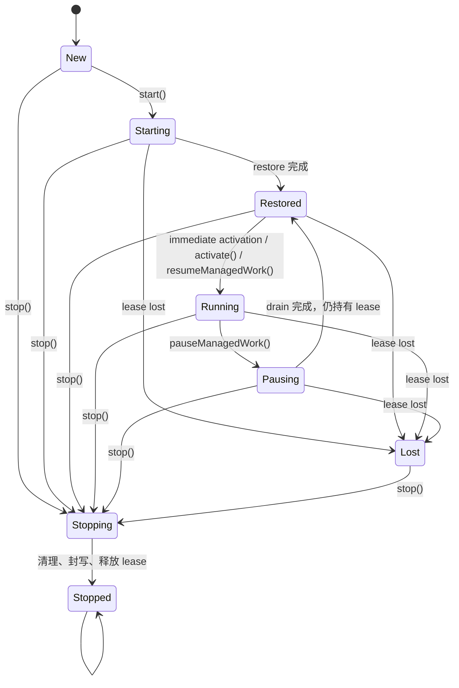

# Lifecycle 与 Run Loop

> 读者：接入启动与停止、处理输入队列、订阅运行状态的人<br>
> 范围：实例生命周期、工作接纳、run 边界与资源收摊；循环内部以 [Run Loop 的四层](run-loop-layers.md) 为准<br>
> 状态：当前实现说明；内部 Agent 的启动与清理限制见 §9，公开入口使用 createEcho

## 导读

**解决什么。** 容器的启动和停止、一次工作的开始和结束是两种生命周期。调用方需要知道何时可以接受输入、何时能换装备，以及何时资源和 lease 已经归还。

**设计主线。** 实例先装配，再取得 lease 并恢复 session，激活后接受工作。前台 run 经 admission 串行执行；一个 run 可包含多条 reply，每条 reply 可包含多个 turn 和 attempt。steer 加入当前 reply，followUp 在同一 run 内开启后续 reply。记忆提取与整理走独立通道，不占前台 permit。

**边界。** 本文不定义共享工作区的文件冲突策略，也不把内部裸 Agent 的测试用法当作另一条产品装配入口。session 布局与会话通信见 [Sessions](sessions.md)，扩展资源归还见 [Extensions](extensions.md)。

## 术语

> 规范词表在仓库根 [CONTEXT.md](../../CONTEXT.md)；本表只列本文用到的，定义以那里为准。

| 术语 | 本文含义 | 不表示什么 |
| --- | --- | --- |
| Agent 实例 | 一个 `Agent` 对象及其持有的会话、锁、后台工作和资源 | 某一次模型调用 |
| run | 从一项工作被 admission 接受，到发出该 run 的 `agent_end` | 整个进程存活期 |
| turn | 一次上下文准备、模型流式请求，以及该次响应中的工具执行 | 一整个用户任务 |
| inner loop | 因 `tool_use`、`max_tokens` 或 `steer` 继续下一 turn | 新 run |
| outer loop | 因 `followUp` 或 stop hook 注入的新工作继续 | 新 Agent |
| foreground | 用户 prompt 或 inbox 工作 | 所有高优先级后台任务 |

源码里的公开 `AgentStatus` 只有 `idle / generating / acting / compacting`，描述的是 run 内状态，而不是实例是否已经 `start()`。实例阶段是另一个私有字段 `phase`。见 [`AgentStatus`](../../packages/core/src/agent.ts#symbol=AgentStatus)、[`AgentState`](../../packages/core/src/agent.ts#symbol=AgentState) 和 [`Agent.phase`](../../packages/core/src/agent.ts#symbol=Agent.phase)。

## 1. Agent 实例生命周期

### 1.1 当前状态机



实现状态为 `new | starting | restored | running | pausing | stopping | stopped | lost`，见 [`Agent.phase`](../../packages/core/src/agent.ts#symbol=Agent.phase)。生命周期命令通过同一条 actor chain 串行化，避免 `start / pause / resume / stop` 交错执行，见 [`Agent.enqueueLifecycle()`](../../packages/core/src/agent.ts#symbol=Agent.enqueueLifecycle)。

这个枚举还不是完整状态机。启动失败发生在 acquire 之前时，`phase` 回到 `new`，允许重试；发生在 acquire 之后时，代码同样把 `phase` 写回 `new`，但另设 `startFencedError` 永久拒绝再次启动，见 [`Agent.startInActor()`](../../packages/core/src/agent.ts#symbol=Agent.startInActor) 和 [`Agent.doStart()`](../../packages/core/src/agent.ts#symbol=Agent.doStart)。也就是说，当前实际还存在一个没有进入 `phase` 联合类型的 `new(fenced)` 终态。因此启动失败后能否重试还取决于 fenced 标记，不能仅凭 phase 判断。

### 1.2 启动前置条件

createEcho 完成装配，调用方随后显式 await echo.start()；模型输入应在启动完成后发送。core 内部的 `Agent` 在没有 stateLock / session service 时仍允许未 start 直接 prompt，这只是 core 单元测试走的路径，仓外构造不出这种实例。

实现见 [Agent.lifecycleManaged](../../packages/core/src/agent.ts#symbol=Agent.lifecycleManaged) 与 [createEcho](../../packages/core/src/create-echo.ts#symbol=createEcho)。`Agent` 类在 core 内部，见 [决策记录](../decisions/implemented/2026-09-07-agent-class-internal.md)。

### 1.3 启动、暂停与恢复

`start()` 有两种激活方式：

- 默认立即激活：取得 lease、恢复状态、安装写入门，然后开放 intake 和后台工作。
- `activation: "deferred"`：只恢复到 `restored`，等待 `activate()`。

开始运行时会启动 schedule catch-up，开放工作门，并按配置触发 dream 与 inbox 消费，见 [`Agent.beginManagedWork()`](../../packages/core/src/agent.ts#symbol=Agent.beginManagedWork)。

`pauseManagedWork()` 会先拒绝新工作，再等待已经接受的 foreground、background 和 durable write 排空；它保留 lease，完成后回到 `restored(paused)`，见 [`Agent.pauseManagedWork()`](../../packages/core/src/agent.ts#symbol=Agent.pauseManagedWork)。`resumeManagedWork()` 重新开放这些入口，见 [`Agent.resumeManagedWork()`](../../packages/core/src/agent.ts#symbol=Agent.resumeManagedWork)。

### 1.4 停止与资源所有权

`stop()` 是生命周期级收摊：阻止新活动、等待存量工作和写入、关闭资源、封住 host write、撤销 write gate，最后释放 lease。清理步骤即使有一处失败也会继续，最终聚合错误，见 [`Agent.stop()`](../../packages/core/src/agent.ts#symbol=Agent.stop) 和 [`Agent.dispose()`](../../packages/core/src/agent.ts#symbol=Agent.dispose)。

装配层的 `echo.stop()` 先逆序卸载外部与 builtin extensions，再调用 `agent.stop()`；多次调用共享同一个 promise，见 [`createEcho()`](../../packages/core/src/create-echo.ts#symbol=createEcho)。所以对 `createEcho()` 的使用者，正确的所有权出口是 `echo.stop()`。

内部 Agent.dispose() 只清理资源，不替代 stop() 的相位迁移和 lease 释放。产品必须使用 echo.stop()，不能用 dispose() 代替完整收摊；该公开面限制见 §9。

## 2. 工作接纳

公开工作入口不是同一种队列语义。

| 入口 | 空闲时 | run 中 | 何时消费 | 是否新 run |
| --- | --- | --- | --- | --- |
| `prompt()` | 接受 | 拒绝 busy | admission 后立即 | 是 |
| inbox | 接受或排队 | 排队 | foreground permit 可用时 | 是 |
| dream / 提取 | 按各自触发条件调度 | 可与前台并行 | 独立记忆通道 | 隔离子循环，不经前台 admission |
| `steer()` | 拒绝 | 当前 turn intake 开放时接受 | 当前 turn 关闭后 | 否，留在当前 reply |
| `followUp()` | 拒绝 | 当前 run intake 开放时接受 | 当前任务完成后 | 否，在同一 run 内开新 reply |

判据来自 [`StandaloneRunAdmission`](../../packages/core/src/admission/standalone.ts#symbol=StandaloneRunAdmission)、[`Agent.prompt()`](../../packages/core/src/agent.ts#symbol=Agent.prompt) 和 [`RunIntakeGate`](../../packages/core/src/loop/intake.ts#symbol=RunIntakeGate)。

### 2.1 Admission 保证

Standalone admission 同时只发一个执行许可，按到达顺序发；来源只有用户与 inbox，都是 foreground。记忆的提取与整理是隔离子循环，走各自的通道、不经 admission（见[记忆设计](memory.md)）。ticket 只 settle 一次并且自身不 reject；callback 抛错会被规范化成终止结果。类型契约见 [`AgentAdmissionTicket`](../../packages/core/src/admission/types.ts#symbol=AgentAdmissionTicket)，实现见 [`StandaloneRunAdmission`](../../packages/core/src/admission/standalone.ts#symbol=StandaloneRunAdmission)。

模型绑定在 admission 时冻结，包括 provider、model snapshot、stream function、key resolver、thinking 和 retry policy，见 [`Agent.modelBinding()`](../../packages/core/src/agent.ts#symbol=Agent.modelBinding)。工具列表不在这里冻结；它按 turn 重新取快照。

需要明确的一项产品选择是：第二个用户 `prompt()` 当前不会排队，而是立即抛 busy；但 inbox 会排队。这个差异已有测试保护，见 [run 中再次 prompt 不排队](../../packages/core/test/invariants.test.ts#test=跑的中途再-prompt-直接-throw不排队也不并发)。这是已确认的 [第二个 prompt 策略](../decisions/implemented/2026-09-01-second-prompt-policy.md)。

## 3. 一次 run 的主循环

admission 接受输入后建立 run intake，循环按 run → reply → turn → attempt 执行；失败与中止沿层级返回 outcome。工具调用或 max_tokens 可继续当前 reply，followUp 与 stop hook 可开启下一条 reply。各层事件、预算与重试规则只在 [Run Loop 的四层](run-loop-layers.md) 维护。

### 3.1 Reply 的继续与结束

每条 reply 的 turn 预算独立计算，run 另有 reply 数上限。stop hook 的继续次数由 [MAX_STOP_CONTINUATIONS](../../packages/core/src/loop/run-loop.ts#symbol=MAX_STOP_CONTINUATIONS) 限制，作为防止无限继续的保险丝，不是产品可配置项。

### 3.2 Run intake 的原子边界

`steer` 只在 active turn 接受，`followUp` 只在 active run 接受。接受与入队同步发生；关闭与 drain 也同步发生，所以一个已经接受的消息不会静默滑到下一 run。未消费的残留必须报告 `queue_dropped`。实现见 [`RunIntakeGate`](../../packages/core/src/loop/intake.ts#symbol=RunIntakeGate)，对应判据见 [裁决、入队与关门处于同一同步步](../../packages/core/test/intake.test.ts#test=runintakegate裁决与入队同一同步步关门那一刻队列里的全部交出之后的一律-rejected)。

run 结束时不是先检查“队列看起来为空”再异步关闭，而是通过 `tryCloseRun()` 在同一同步边界完成最后一次 drain 与关门。这是 late follow-up 不丢失的关键判据。

## 4. 一个 turn 的执行顺序

每个 turn 先冻结工具与 hook 工作集，再进入 attempt 循环；每次 attempt 重建上下文并请求模型。只有落地的响应进入工具批执行，最后关闭 turn intake 并交出 steer。完整顺序见 [Run Loop 的四层](run-loop-layers.md) §2。

工具执行路径会在工作集快照里查找工具，准备并冻结参数，运行 pre-hook，执行授权/询问，再调用工具，最后运行 post-hook 并产出 tool result。见 [`runOneTool()`](../../packages/core/src/loop/run-turn.ts#symbol=runOneTool)。

工具和 hook 在一个 turn 内稳定；turn 进行中新增或移除的注册，只能在下一个 turn 被看见。这条边界已有判据，见 [本轮中途注册的工具下一轮才可用](../../packages/core/test/seams.test.ts#test=本轮中途注册的工具即使被同一条消息点中也不执行下一轮才可用)。

### 4.1 并行工具批

工具是否可以并行由自身的 concurrent 声明决定，取舍见 [并行工具决策](../decisions/implemented/2026-09-07-parallel-tools.md)。

- 工具自己声明 [`ToolBase.concurrent`](../../packages/core/src/tools/types.ts#symbol=ToolBase)（缺省 false = 独占）。
- 同一条 assistant 消息里**连续的**可并行调用切成一批同跑，碰到没标的就断批、它自己一批；切批见 [`runTurn()`](../../packages/core/src/loop/run-turn.ts#symbol=runTurn) 的 `takeBatch`。
- 批内：`tool_execution_*` 交错（按 `toolCallId` 配对）；**toolResult 入账按 tool_use 出现顺序**，不按完成顺序；授权询问串行（同一时刻只挂一个问）；`preToolUse` / `postToolUse` 每工具各跑一遍，hook 作者不能假设批内顺序。
- 中止：已起跑的那一批各自收 signal 结束、结果照样入账，剩下的批不跑。

判据在 [并行工具的行为测试](../../packages/core/test/parallel-tools.test.ts#test=两个-concurrent-工具同批第二个的-toolexecutionstart-在第一个的-toolexecutionend-之前)——同一文件里还有反例：[去掉 `concurrent` 就退回逐个跑](../../packages/core/test/parallel-tools.test.ts#test=缺省不并行同样两个探针去掉-concurrent就退回-astart-aend-bstart)。

## 5. 快照边界与动态边界

| 数据 | 冻结时点 | run 中能否变化 |
| --- | --- | --- |
| model / provider / stream function | admission | 不能影响当前 run |
| retry / thinking / key resolver | admission | 不能影响当前 run |
| tools / known tool names | 每个 turn 开始 | 下一 turn 可见 |
| hooks 工作集 | 每个 turn 开始 | 下一 turn 可见 |
| steer | turn intake 开放期间 | 当前 turn 后消费 |
| followUp | run intake 开放期间 | 当前任务后消费 |
| transcript projection | 每个事件 apply 时 | 持续变化 |

`AgentContext` 是每次 run 的消息与 system prompt 快照，但工具故意不在其中；工具通过 `getTools()` 每 turn 获取。见 [`AgentContext`](../../packages/core/src/loop/types.ts#symbol=AgentContext)。

## 6. 完成、失败与中断

调用方需要区分“run 的业务结果”和“API 调用失败”：

| 情况 | 当前对外结果 |
| --- | --- |
| 正常完成 | `LoopResult.outcome.kind === "completed"` |
| provider 最终失败 | prompt resolve，outcome 为 `error` |
| 主动 abort | prompt resolve，outcome 为 `aborted` |
| 最大迭代或 deadline | 对应 terminal outcome |
| 工具抛错 | 转成 error tool result，run 可继续 |
| 自动压缩阶段失败 | 记录诊断并尝试后续策略；撞窗应急仍无法继续时以错误结束 |
| busy、未启动、已停止等 API 误用 | 方法 reject / throw |
| listener 或持久化等回调失败 | 尽量规范化为完整 terminal event/result |

`AgentOutcome` 定义见 [`AgentOutcome`](../../packages/core/src/events.ts#symbol=AgentOutcome)，callback failure 的终止规范化见 [`Agent.normalizeAdmittedCallbackFailure()`](../../packages/core/src/agent.ts#symbol=Agent.normalizeAdmittedCallbackFailure)。“provider 错误不让 prompt reject”已有测试，见 [不可重试失败形成 outcome 而非 prompt rejection](../../packages/core/test/invariants.test.ts#test=不可重试的失败-agentend-带结构化-outcomeprompt-不-reject)。

### 6.1 Abort 原因

Agent.abort(reason) 通过 AbortSignal 把原因传到最终 aborted outcome；裸 abort 可以没有 reason。run deadline 则归为 timeout 错误，不与主动中断混同。行为归属与测试见 [abort reason 决策](../decisions/implemented/2026-09-01-abort-reason.md) 和 [Run Loop 的四层](run-loop-layers.md) §6。

## 7. 事件、状态投影与持久化

一个 loop event 的处理顺序是：

1. apply 到公开 `AgentState` 投影；
2. 执行必需的 session persistence；
3. 调用不阻塞控制流的 observation tap；
4. await 普通 listeners。

实现见 [`Agent.processEvents()`](../../packages/core/src/agent.ts#symbol=Agent.processEvents)。必需持久化只覆盖 `message_end`、`compaction_end` 和 error `agent_end` 等边界，见 [`Agent.persist()`](../../packages/core/src/agent.ts#symbol=Agent.persist)。

这里能成立的窄表述是：**公开 run state 的主要投影由事件驱动**。不能写“Agent 所有状态都是 event-sourced”：实例 `phase`、资源注册表、intake 队列、后台任务和 lease 都有各自的直接状态变更路径。

### 7.1 `agent_end` 不等于已经 idle

run loop 先原子关闭 intake、发出 `agent_end` 并返回；admission ticket settle 之后，Agent 才把公开 status 设回 `idle` 并调度 inbox/dream。顺序见 [`runLoop()`](../../packages/core/src/loop/run-loop.ts#symbol=runLoop) 和 [`Agent.finishRun()`](../../packages/core/src/agent.ts#symbol=Agent.finishRun)。

监听器处理 agent_end 时仍可能看到 generating。该事件表示 run 事件流封口，不是 idle barrier；顺序由 [Agent.finishRun()](../../packages/core/src/agent.ts#symbol=Agent.finishRun) 完成。等待 prompt()/continue() 返回后再发下一项工作；需要响应自主工作带来的状态变化时订阅状态。命名与边界见 [决策记录](../decisions/implemented/2026-09-01-agent-end-barrier.md)。

## 8. 哪些由机器守，哪些只是纪律

### 已有机器判据

| 性质 | 机器判据 |
| --- | --- |
| lifecycle 命令串行、停止幂等、丢锁后拒绝工作 | [并发 start 共享一次启动](../../packages/core/test/lifecycle-guard.test.ts#test=并发两个-start-共享同一次启动都成功)、[start/stop 幂等](../../packages/core/test/lifecycle-guard.test.ts#test=stop-幂等start-幂等)、[丢锁成为终态](../../packages/core/test/lifecycle-guard.test.ts#test=丢锁之后-phase-变-lost不能再-start) |
| run admission 单 permit、优先级、回调失败终止化 | [Standalone admission conformance](../../packages/core/test/admission.test.ts#test=conformancestandalonerunadmission-通过)、[终态前回调失败仍完整封口](../../packages/core/test/admission.test.ts#test=终态之前-listener-抛错agentstart-就炸runloop-在-finally-里封口-agentendagent-不再合成第二个没开过的层不补) |
| steer / followUp 的接受窗口与原子关闭 | [RunIntakeGate 原子裁决](../../packages/core/test/intake.test.ts#test=runintakegate裁决与入队同一同步步关门那一刻队列里的全部交出之后的一律-rejected) |
| tool/hook 的 turn snapshot 边界 | [本轮注册的工具下一轮才可用](../../packages/core/test/seams.test.ts#test=本轮中途注册的工具即使被同一条消息点中也不执行下一轮才可用) |
| agent / turn / message / tool 事件基本配对 | [规范后端的 start/end 成对](../../packages/core/test/invariants.test.ts#test=规范后端start-在前end-在后成对)、[工具调用与结果入账](../../packages/core/test/invariants.test.ts#test=模型要工具-继续内层工具结果入账) |
| 公开 lifecycle 方法的类型形状 | [生命周期方法签名快照](../../packages/core/test/lifecycle-api.test.ts#test=生命周期四个方法的签名快照编译期钉死-运行时确实在公共面上) |
| 并行工具的批边界、结果顺序、询问串行、批中 abort | [同批真的同跑](../../packages/core/test/parallel-tools.test.ts#test=两个-concurrent-工具同批第二个的-toolexecutionstart-在第一个的-toolexecutionend-之前)、[不标就不并行](../../packages/core/test/parallel-tools.test.ts#test=缺省不并行同样两个探针去掉-concurrent就退回-astart-aend-bstart)、[入账按 tool_use 顺序](../../packages/core/test/parallel-tools.test.ts#test=完成顺序倒过来transcript-里-toolresult-仍按-tooluse-顺序)、[询问批内串行](../../packages/core/test/parallel-tools.test.ts#test=同批两个都要-askpendingpermissions-任一时刻-1问的顺序-tooluse-顺序)、[批中 abort 全员入账](../../packages/core/test/parallel-tools.test.ts#test=批中-abort已起跑的各自收-signal-结束每个-tooluse-都有对应的-toolresult记-error) |
| `echo-coding` 只给只读工具标 `concurrent` | [identity 里的并发名单](../../packages/coding/test/identity.test.ts#test=identity-的工具集与-prompt-与真装出来的-coding-agent-一致漂移即红) |

### 人工责任

工具作者负责判断副作用是否允许并行；core 只执行 concurrent 声明。事件配对和结果顺序的测试不证明工具本身没有并发冲突。

## 9. 当前限制

- Agent 类内部化尚未完成，裸类仍公开 start / dispose 等内部入口；产品应使用 createEcho 和 echo.stop()，不自行复制前置条件。
- acquire 后启动失败的 fenced 状态由额外标记表达，phase 本身不足以决定能否重试。
- 每段 session 的 lease 保护状态根，不解决多个 session 同时修改同一代码工作区的文件冲突。

这些限制不改变已确认的前台忙时拒绝、abort 原因透传和 agent_end 非 idle barrier 语义。历史探针归档在 [复核记录](../code-review/2026-09-15-doc-probes.md)，不再作为当前缺陷输出维护。

## 10. 验证

主路径测试：

```bash
bun test packages/core/test/lifecycle-api.test.ts \
  packages/core/test/lifecycle.test.ts \
  packages/core/test/lifecycle-guard.test.ts \
  packages/core/test/admission.test.ts \
  packages/core/test/intake.test.ts \
  packages/core/test/phases.test.ts \
  packages/core/test/invariants.test.ts
```

测试通过只证明各用例断言的行为。

核实并行工具真的有执行分支和测试：

```bash
rg -n --text 'concurrent' packages/core/src/loop packages/core/src/tools/types.ts
bun test packages/core/test/parallel-tools.test.ts
```

`takeBatch()` 是唯一读 `concurrent` 的地方，行为判据在 `parallel-tools.test.ts`。
运行参数与并行行为以 concurrent 的实现和上述测试为准。
