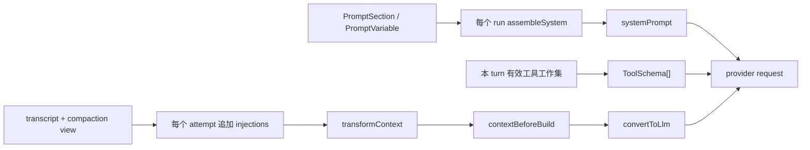

# Prompt：模型输入的装配与刷新

> 读者：修改模型身份、工具提示、项目指令或动态上下文的人<br>
> 范围：system sections、变量、工具描述、attempt 注入及其失败语义<br>
> 状态：当前实现说明；注册边界与输入预算的限制见 §9

## 导读

**解决什么。** 让每项模型可见材料有明确的来源、所有者和刷新时机，避免不同能力独立覆盖同一条 system 字符串。

**设计主线。** 模型请求有三种载体：工具 schema 按 turn 冻结，system 按主 run 装配，messages 在每个 attempt 重建。extension 注册具名 system section；拥有能力的模块负责它的内容，装配器只做排序、渲染、插值和连接。

**边界。** 消息入账与投影见 [上下文与消息流](context-and-message-flow.md)，扩展资源归还见 [Extensions](extensions.md)，角色身份见 [Sessions](sessions.md)。提示词的语义有效性需要模型评测，不由链接或编译门证明。

## 1. 模型输入的三种载体

一次主 Agent 的 provider 请求由三个正交载体组成：

| 载体 | 当前真源 | 刷新时机 | 适合放什么 |
| --- | --- | --- | --- |
| `tools` | 本 turn 冻结的有效工具工作集，再投影为 schema | 每个 turn 一次 | 单工具名字、description、参数与返回契约 |
| `systemPrompt` | `AgentPrompt` registry 中的 sections + variables | Agent 路径每个 run 一次 | 身份、纪律、交互面、相对稳定的环境事实与跨工具习惯 |
| `messages` | 压缩后的 transcript 视图 + attempt injection，再经 transform / hook / projection | 每个 attempt 一次 | 对话事实与运行中会变化、但不应入账的临时材料 |

主调用顺序见 [`Agent.createContextSnapshot()`](../../packages/core/src/agent.ts#symbol=Agent.createContextSnapshot) 与 [`runAttempt()`](../../packages/core/src/loop/run-turn.ts#symbol=runAttempt)：



“prompt”在本文有宽窄两层含义：宽义是模型会读到的全部指令资产，包括工具 description 和 message injection；窄义的 `prompt/`模块只负责 system sections 的排序、渲染与插值。工具 schema 不能再从 prompt模块造第二份目录，消息 projection 也不属于它。

另有三条刻意不走主 Agent 装配器的调用路径，各自定义 system 的来源与刷新规则：

- `subagent` 的任务、system 与工具集由父模型在调用时给出（fresh），或整套继承父这次 run 的装配（fork），见 [`SubagentSpec`](../../packages/core/src/subagent/tool.ts#symbol=SubagentSpec) 与 [`Agent.runSubagent()`](../../packages/core/src/agent.ts#symbol=Agent.runSubagent)。
- compaction 的 collapse / summary 使用自己的固定 prompt，归压缩策略所有，见 [`defaultCompactionStages()`](../../packages/core/src/compaction/builtin.ts#symbol=defaultCompactionStages)。
- Dream 复用隔离循环但 system 为 `null`；它的整理指令由 memory模块提供，见 [`dreamTask()`](../../packages/core/src/memory/harness.ts#symbol=dreamTask)。

## 2. 注册接口与所有权

外部 extension 真正需要学习的接口只有两层：

- [`PromptSection`](../../packages/core/src/prompt/types.ts#symbol=PromptSection)：稳定名字、数值 `order`、一个从 `AssembleContext` 渲染字符串的函数。
- [`AgentPromptRegistry`](../../packages/core/src/extension/registries.ts#symbol=AgentPromptRegistry)：注册 section 或 variable，取得由 Fiber 持有的 disposer；同名默认判红。

[`definePromptPack()`](../../packages/core/src/extension/builtin.ts#symbol=definePromptPack) 把一组纯 prompt sections 变成 extension；[`defineToolPack()`](../../packages/core/src/extension/builtin.ts#symbol=defineToolPack) 把工具与它们的跨调用提示放进同一个 effect。两者共用原子注册：中途任何一项失败，已经注册的项逆序撤回；卸载也按所有权撤回。内建 `echo:*`、两个产品和第三方 extension 走同一个 registry，没有 core 私道。

内容所有权按事实来源划分，而不是按“都属于 prompt”集中到一个文件：

| 内容 | owner | 当前实现 |
| --- | --- | --- |
| 通用 / coding 身份与纪律 | 产品 | [`ECHO_AGENT_IDENTITY`](../../packages/cli/src/prompt.ts#symbol=ECHO_AGENT_IDENTITY)、[`CODING_IDENTITY`](../../packages/coding/src/prompt.ts#symbol=CODING_IDENTITY)；通用纪律 [`conductSection()`](../../packages/base/src/prompt.ts#symbol=conductSection) 按有人 / 无人形态两版，由产品 preset 挂；coding 纪律 [`CODING_CONDUCT`](../../packages/coding/src/prompt.ts#symbol=CODING_CONDUCT) |
| 终端的交互说明 | 壳 | [`terminalSurfaceSection()`](../../packages/tui/src/prompt.ts#symbol=terminalSurfaceSection) 与 TUI extension |
| pipe 的交互说明 | 装配层 | [`pipeSurfaceSection()`](../../packages/base/src/prompt.ts#symbol=pipeSurfaceSection)（非交互形态由 `runPiped()` 挂） |
| workspace、model、provider | core Agent | [`environmentSection()`](../../packages/core/src/prompt/sections.ts#symbol=environmentSection) |
| AGENTS.md / CLAUDE.md | 能读 workspace 的 CLI 层 | [`instructionsSection()`](../../packages/base/src/instructions.ts#symbol=instructionsSection) |
| skill 目录与激活正文 | skill module | [`renderSkillCatalog()`](../../packages/core/src/skill/compose.ts#symbol=renderSkillCatalog)、[`renderSkillInjections()`](../../packages/core/src/skill/compose.ts#symbol=renderSkillInjections) |
| memory 规则与内容 | memory模块| [`memoryPromptSections()`](../../packages/core/src/memory/harness.ts#symbol=memoryPromptSections) |
| task 快照 | task module | [`renderTaskInjection()`](../../packages/core/src/task/tools.ts#symbol=renderTaskInjection) |
| 某组工具的跨调用习惯 | 拥有该工具组的 extension | [`sessionToolsSection()`](../../packages/core/src/session/tools.ts#symbol=sessionToolsSection)、[`compactionSection()`](../../packages/core/src/compaction/tool.ts#symbol=compactionSection) |

`new Agent()` 是低层使用高度：它构造各能力本体，但 prompt registry 初始为空。`mountBuiltinTools()` 只把可用的内建能力经 extension 注册上去；产品 identity、conduct 和 surface 仍由产品 / 壳提供。`createEcho()` 是唯一高层 composition root，挂载顺序为 builtin → inline → 盘上发现 → 显式 `opts.extensions` → 角色；角色最后，因为它要替换的 `identity` 来自显式那一代（§3.3，[Extensions](extensions.md) §2）。

所有模型可见文本——system section、attempt injection、工具的 description / 参数说明 / 返回文本、系统投进会话的 `environment` 消息——都用英文写；人面文字（CLI usage、TUI 文案、工具的 `label`、诊断与 run 错误）不受此约束。决定见 [模型面全英文](../decisions/implemented/2026-09-01-model-facing-english.md)。这条没有机器门，新代码是否漂回中文只能靠 review。

## 3. System sections 与装配

### 3.1 Order 是排序带，不是重要性或刷新策略

[`PROMPT_ORDER`](../../packages/core/src/prompt/types.ts#symbol=PROMPT_ORDER) 给出开放的约定带：

| order | 含义 | 当前例子 |
| ---: | --- | --- |
| 0 | 产品身份 | `identity`；角色可受控替换同名段 |
| 10–19 | 工作纪律 | 通用 `conduct`、coding `conduct:coding` |
| 20–29 | 交互面 | `surface`（terminal / pipe 同名互斥） |
| 100–199 | 工具的跨调用习惯 | workspace、shell、sessions、compaction |
| 300 | run / session 环境事实 | workspace、model、provider |
| 400 | workspace 项目指令 | AGENTS.md，找不到才看 CLAUDE.md |
| 500 | skill 目录 | 只列 model-invocable skills |
| 900 | memory | 最常变化，放在末尾 |

数值越小越靠前；同数保注册序。排序意图是把更稳定的字节留在前缀，不代表 core 提供或承诺 provider cache。`order` 也不决定刷新频率：刷新由 system / turn / attempt 所在的生命周期决定。

### 3.2 精确装配语义

[`assembleSystem()`](../../packages/core/src/prompt/assemble.ts#symbol=assembleSystem) 的顺序固定为：

1. 复制 sections 并按 `order` 稳定排序。
2. 在渲染任何 section 前，一次性执行**全部已注册** variable providers；即使某变量没有被任何段引用也会执行。
3. 逐段调用 `render(ctx)`；抛错的段省略并交给 `onFailure` 留诊断。
4. 对成功结果做严格 `{{name}}` 插值，再 `trim()`；空结果不占位。
5. 非空段用两个换行连接；全空返回 `null`。

完整的 `{{name}}` 必须名字合法、已经注册且本次有值，否则抛 `PromptVariableError`；孤立且没有 `}}` 的 `{{` 作为普通文本保留；替换值不二次扫描。现有门见 [排序与空段](../../packages/core/test/prompt.test.ts#test=按-order-升序同数保注册序空段丢弃全空返回-null) 和 [严格插值](../../packages/core/test/prompt.test.ts#test=未注册-无值-畸形三种都抛-promptvariableerror带段名)。

[`sectionFromMarkdown()`](../../packages/core/src/prompt/import.ts#symbol=sectionFromMarkdown) 接受极简 frontmatter：`name`、整数 `order`，缺 order 为 0；`tier`、frontmatter 与 `fallbackName` 都没给名字、非整数 order 判红。正文去掉首尾空白，不保证字节级原样保留。

### 3.3 角色只替换 identity

普通 `section()` 同名判红。只有显式 `{ replace: true }` 才能替换，而且同名原段必须存在；disposer 恢复原段而不是删除它。当前唯一生产消费者是 [`inlineAgentExtension()`](../../packages/core/src/agent-def/extension.ts#symbol=inlineAgentExtension)：角色正文替换产品的 `identity`，工具白名单另走 `AgentTools.restrict()`，模型缺省由 composition root 解析。createEcho 将角色放在产品显式扩展之后挂载，保证原 identity 已有机会注册；挂载顺序见 [Extensions](extensions.md) §2。

“必须先有 identity”是有意判据：没有产品身份时，静默追加一段与替换产品身份不是同一个动作。现有门见 [替换与卸载复原](../../packages/core/test/agent-def.test.ts#test=identity-被替换工具收成子集unmount-两样都复原) 和 [没有原 identity 时判红](../../packages/core/test/agent-def.test.ts#test=产品没有-identity-段时判红悄悄多出一段和替换是两件事)。

## 4. 刷新与缓存语义

主 Agent 路径的时间边界如下：

| 数据 | 何时取快照 | 同一 run 内变化何时可见 |
| --- | --- | --- |
| system sections / variables | admission 后、run 开始前装配一次 | 本 run 不变；下一 run 重装配 |
| 工具工作集 | 每个 turn 开头冻结 | 下一 turn |
| skill / task injections | 每个 attempt 构建 working context 时重算 | 下一 attempt；通常就是下一 turn，重试时可能仍是同一 turn |
| transcript / compaction view | 每个 attempt 重建 | 按账本与压缩流水线的时序 |
| transform / `contextBeforeBuild` / projection / key | 每个 attempt | 当次调用 |

因此“每轮注入”只是历史名字，不是准确生命周期。重试属于同一个 turn 的下一个 attempt，[`callModel()`](../../packages/core/src/loop/run-turn.ts#symbol=callModel) 会重新取 injection、重新 transform、重新过 hook 与 projection。任何有副作用的回调都必须自行幂等。

system 的“冻结”只指主 Agent 从 registry 装配的快照。内部 loop 边界 的 `prepareNextTurn` 仍能直接替换 `AgentContext.systemPrompt`，但 Agent 没有把它暴露为产品或 extension 的 prompt 写入口。子 agent 和 compaction 调用也各自使用独立 system，不能据此声称“进程里所有模型调用的 system 每 run 都不变”。

缓存层面只承诺仓库自己的确定性：sections 稳定排序、工具 schema 按名排序、时间戳不进固定 prompt、injection 追加在消息尾部。是否命中、命中多少以及 tools / system / messages 在厂商缓存里的相对位置，都是 provider 行为，不是 core 契约。

## 5. 工具与 prompt 必须同真同假

工具有三份不同但相关的模型资产：

1. 单工具 description 与参数 schema，跟随工具对象进入 `tools`。
2. 跨多个工具的选择与时序习惯，跟随拥有这组工具的 extension 进入 system section。
3. 依赖某件工具的动态材料，例如 task 清单要求模型能调用 `TaskList`，skill 目录要求能调用 `skill_activate`。

`defineToolPack` 把前两项放在同一个 owner / effect 里，解决的是“工具卸载而说明还在”。但 `AgentTools.restrict()` 只收紧有效工作集，不卸载池中对象，也不撤掉 pack 的 sections。角色限制与 section 呈现尚未联动：默认 coding 产品把 `tool:shell` / `tool:workspace` 等段照常注册，角色即使把这些工具排除，system 仍教模型使用它们。

目前 skills 目录读取工具池，而角色限制作用于有效工作集。因此能力提示可能与角色可用工具不一致，见 §9。判断这类一致性应使用有效能力集合，而不是把尚未加载的 deferred 工具一律视为不可用。

## 6. Attempt injections

动态注入先加到压缩后的 working copy 末尾，再交给 `transformContext` 与 `contextBeforeBuild`，所以两者看到完整材料并有最后话语权。注入不发 `message_end`、不进 transcript、也不落 session；时间戳固定为 0，避免每次重算只因时间不同而换字节。

当前主 Agent 内部只有两种来源：

| 来源 | 何时出现 | 体积规则 | 工具门控 |
| --- | --- | --- | --- |
| 已激活 skill 正文 | 激活后的下一 attempt，停用后消失 | 单条正文 16 000 字符；激活集合按截断后正文合计 64 000；临时 instructions 500 | 激活工具决定状态；正文按 active set 渲染 |
| task snapshot | active / ready 任一非空 | 两组各最多 10 条；完成与阻塞项不重复注入 | 读本 turn 冻结菜单里的 `TaskList` |

skill 的总预算在激活时拒绝超额，而不是渲染时静默丢掉已经激活的内容；该预算不包含最终消息的全部包装开销。task 的条数限制不是字符预算：`TaskSpec.title` 只验非空，`renderList()` 原样插入 title / executor。一条 100 000 字符、带换行的标题会生成 100 000 字符以上的 injection，并能造出新的 Markdown 标题。因此 task injection 当前没有字符总上界。

PromptSource 虽从根入口导出，但当前只由 Agent 内部构造，AgentOptions 与 AgentPromptRegistry 没有 source 注册方法。它不能作为第三方动态注入入口；生命周期命名与公开面限制见 §9。

Dream 继承父 Agent 的 injections；fresh 模式的 subagent 明确关闭它们，因为子 agent 看不到父会话、拿到的是调用者单独给的 task / system / tools；fork 模式与 Dream 一样继承。接线见 [`Agent.runSubagent()`](../../packages/core/src/agent.ts#symbol=Agent.runSubagent)。

## 7. 文本来源、预算与信任

这里必须分开三个概念：

- **instruction authority**：模型是否应该遵循这段文字。
- **结构卫生**：单行化、围栏、截断是否让格式与体积可控。
- **安全隔离**：不可信文字是否无法改变更高层指令的含义。

[`singleLine()`](../../packages/core/src/prompt/sanitize.ts#symbol=singleLine)、[`fenceSafe()`](../../packages/core/src/prompt/sanitize.ts#symbol=fenceSafe) 与 [`truncateMarked()`](../../packages/core/src/prompt/sanitize.ts#symbol=truncateMarked) 只提供第二项：折叠换行、替换反引号、截取前缀并留下标记。它们不提供第三项，也不应该叫 sanitizer 或“安全边界”。

| 来源 | authority | 当前卫生措施 | 必须如实说明的限制 |
| --- | --- | --- | --- |
| 产品 / extension 字面量 | 产品代码 | 无；视为受信 | 改文案就是改模型行为，应与代码一起 review |
| workspace 的 AGENTS.md / CLAUDE.md | 作为用户自己的项目指令执行 | 反引号替换、正文前缀 65 536 字符、XML-like 标记、闭合标签中和（[`neutralizeClosingTag()`](../../packages/base/src/instructions.ts#symbol=neutralizeClosingTag) 把正文里 `</project-instructions>` 及其大小写 / 空白变体的 `<` 换成全角） | 中和只让标签整齐，正文照样是模型要执行的指令；第三方仓库本身不可信时，靠 prompt 包装无法授权它 |
| skill 正文与激活参数 | 被激活后作为工作指令执行 | 围栏字符替换、单条和总预算、参数单行化 | 起止标记不是安全沙箱；skill 的安装 / 激活就是信任决定 |
| memory | 跨 run 的持久背景 | resident / index 各自有预算；索引描述单行化 | 正文有意保留多行并直接影响模型，旧记忆可能陈旧或被污染 |
| task title / executor | 只应是清单数据 | 只有条数上限 | 当前可换行、可无界增长，能伪装成额外指令段 |
| prompt variables | section 引用的运行事实 | 无转义，替换值不重扫 | workspace 等字符串原样进入 system；它们不是模板代码，但仍能包含换行 |

项目指令尤其不能写成“定界与消毒保证结构隔离”。它们本来就是要模型执行的用户级指令；若用户打开第三方仓库，真正的信任决策应发生在宿主权限、确认与沙箱层。把 `</project-instructions>` 替换掉也不会让正文失去指令性，只会让标签更整齐。

`INSTRUCTIONS_CAP` 也是正文前缀的 cap，不是最终 section 长度上限：`truncateMarked()` 会在截取的前缀后追加 marker，header / tags 再增加固定字节。文档和注释应称“正文截断阈值”，机器判据则检查最终输出的明确上界，而不是声称 `out.length <= INSTRUCTIONS_CAP`。

## 8. 失败与可观测性

| 失败点 | 当前行为 | 评价 |
| --- | --- | --- |
| `PromptSection.render()` 抛错 | 省略该段；异步发 `[prompt_section_failed]` 通知；run 继续 | 对增强段合理；对 identity 等关键段没有表达力 |
| variable provider 抛错 | 整次装配失败；即使变量未被引用也会发生 | 接口 未写清 provider 必须纯且不抛 |
| 变量未注册 / 无值 / 引用畸形 | `PromptVariableError`；模型不被调用，run 以 error 收场 | 作者错误 fail-loud，应该保留 |
| attempt injection / transform / projection / key 抛错 | attempt 记 internal failure，run 以 error 收场 | 实现 fail-loud，但多处注释仍写“绝不抛、失败回退” |
| `contextBeforeBuild` 返回 block | 不调用 provider，不合成 assistant 消息；reply / run 以 aborted 收场 | 已与 hook 接口 对齐 |
| extension 注册撞名或 role 替不到 identity | mount 失败并回滚该 generation | 所有权清楚，应该保留 |

PromptSection 不区分 required / optional，render 异常统一省略。产品若将关键策略放在可能失败的动态 render 中，必须自行处理失败；段名 identity 不会自动得到更强的失败保护。

装配出的 system 本身不写入 session。角色定义快照存在 session 元数据中，memory 与 workspace 文件在各自位置维护，不是本次请求的逐字快照。这意味着同一 session 在下个 run 可能因文件、extension 或模型装备变化得到不同 system，符合“每 run 装配”的设计，但排障需要能看到当次实际请求或稳定 digest。当前 prompt 单测证明字节与行为，不能替代生产观测对“这次到底发了什么”的回答。

## 9. 当前限制

- **底层注册可绕过。** Agent.promptSections / promptVariables 仍是可写 Map，registry 的名字、顺序值与所有权校验只守经过 registry 的路径。产品使用扩展注册，不直接改容器。
- **能力提示与角色限制尚未统一。** 工具包的 section 不随 restrict 自动消失，skills 目录也读取原始工具池；工具禁用后相关提示可能仍在。
- **生命周期命名有历史差异。** getTurnInjections 实际每个 attempt 调用，重试时会重算。这是已确认的上下文重建行为，不应改回每 turn 只算一次；PromptSource 仍是公开但没有外部注册入口的内部来源类型。
- **上下文字段含义需按实现读取。** AssembleContext.agentId 当前赋值为 product，不代表角色身份。
- **预算与信任有限。** task 标题和 executor 未建立注入字符总上界；格式定界与反引号替换不能证明外部文本不会影响模型指令理解。
- **正文也参与模板解析。** assembleSystem 对整个 render 结果插值，项目文件或记忆里的完整双花括号可能被当成变量引用，未注册时装配失败。当前没有独立的原文通道。

角色替换顺序已由 createEcho 的产品先、角色后挂载解决，不再列作当前缺陷。历史审阅命令见 [复核记录](../code-review/2026-09-15-doc-probes.md)；其中旧失败输出不代表当前行为。

## 10. 验证边界

已有门能推出的只有这些：

| 性质 | 证据 |
| --- | --- |
| section 排序、空段、render 失败 | [prompt 装配测试](../../packages/core/test/prompt.test.ts#test=按-order-升序同数保注册序空段丢弃全空返回-null) |
| 严格变量引用使错误 run 在调用模型前结束 | [变量错误测试](../../packages/core/test/prompt.test.ts#test=变量错-run-以-error-收场不静默发一份错的-system) |
| prompt / tool pack 原子注册、卸载、撞名回滚 | [pack 测试](../../packages/core/test/prompt.test.ts#test=definepromptpack-definetoolpack-带段mount-进表unmount-撤走撞名整包回滚) |
| role identity 的受控替换与复原 | [agent definition 测试](../../packages/core/test/agent-def.test.ts#test=identity-被替换工具收成子集unmount-两样都复原) |
| skill / task 动态材料不进 transcript，system 在 run 内不随其变化 | [主接线测试](../../packages/core/test/prompt.test.ts#test=内建段经-echo-进-system环境段带-workspacemodelskills-目录在激活后下一轮注入可见system-逐字节不变)、[task 测试](../../packages/core/test/prompt.test.ts#test=任务清单每轮注入空清单不占位建完下一轮就可见不打-system-缓存不进-transcript) |
| 注入里的工具门控使用本 turn 冻结菜单 | [冻结菜单测试](../../packages/core/test/prompt.test.ts#test=注入的工具门控读本轮冻结的菜单turnstart-里才注册的-tasklist本轮菜单与清单都没有下一轮一起出现) |
| 默认 coding 产品的 prompt 文本、工具集与执行预算同源 | [identity 漂移测试](../../packages/coding/test/identity.test.ts#test=identity-的工具集与-prompt-与真装出来的-coding-agent-一致漂移即红) |

这些门不证明文案有效、不证明项目指令或 skill 安全、不证明角色口吻适合任务，也不证明不同 provider 对同一 system 的遵循程度。以下仍只能由人审：身份与纪律是否冲突、某项行为该放 description 还是跨工具 section、文案是否诱导模型越权、项目指令 / skill 的信任来源、预算损失是否值得、模型评测是否真的改善。机器可以守字节、所有权、刷新、上限与失败语义，不能替人批准 prompt 的意思。

## 11. 验证命令

```bash
bun test packages/core/test/prompt.test.ts \
  packages/core/test/agent-def.test.ts \
  packages/core/test/skill.test.ts \
  packages/cli/test/prompt.test.ts \
  packages/coding/test/identity.test.ts

bun scripts/docs-lint.ts
bun test test/docs.test.ts test/export-jsdoc.test.ts
```

测试只证明表中已有判据；§9 的限制需要各自独立的行为测试，不能由文档检查通过推导为已解决。
