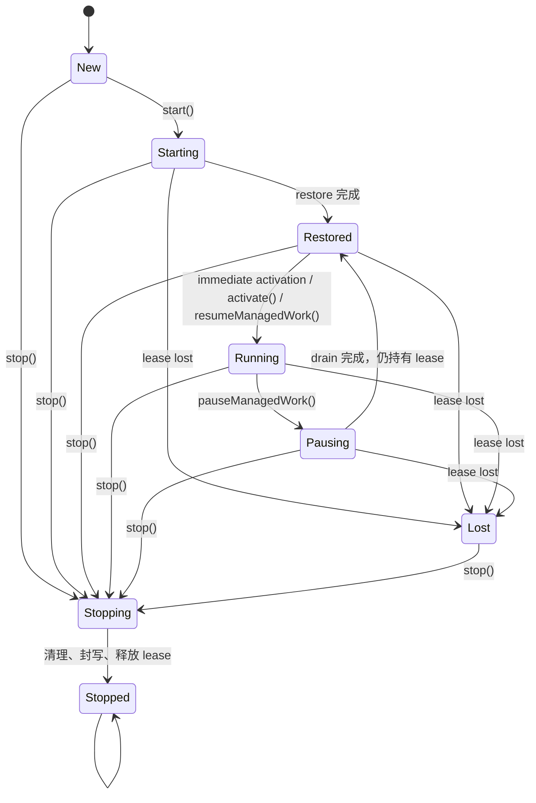
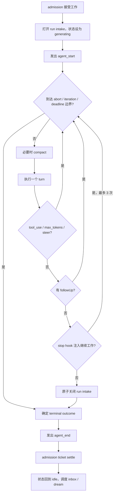

# Lifecycle 与 Run Loop（审阅稿）

> 状态：审阅中，尚未成为设计契约<br>
> 基线：2026-08-31 当前源码与测试<br>
> 范围：Agent 实例生命周期、一次 run 的执行循环、工作接纳、中断与收摊<br>
> 暂不处理：多会话并发、state root 的 writer 模型、存储布局、具体 provider 协议

这份文档先回答“代码现在实际上怎么运行”，再列出需要产品和设计共同拍板的地方。未经拍板的现状不会被写成目标设计。

## 结论先行

当前实现里有两套不同的生命周期：

1. **Agent 实例生命周期**：创建、恢复、运行、暂停、停止、丢锁。
2. **一次 run 的生命周期**：接纳工作、生成、执行工具、压缩上下文、结束。

run loop 本身已经形成了一条可解释的主线：同一时刻只执行一个 run；每个 turn 先冻结工作集，再请求模型，再顺序执行工具；`steer` 在当前 turn 后生效，`followUp` 在当前任务结束后、同一 run 内生效；run intake 原子关闭后才发出 `agent_end`。

但公开 API 还没有形成同样清楚的契约。审阅前必须处理或明确接受以下问题：

- `Agent.start()` 表示实例启动，`agent_start` 却表示一次 run 开始；同一个词指两件事。
- 同一个 `Agent` 类存在两种启动契约：带持久化或状态锁时必须先 `start()`，裸内存 Agent 却可以直接 `prompt()`。
- `Agent.dispose()` 是公开方法，但直接调用不会释放 `StateLock`；生命周期托管的 Agent 必须走 `stop()`。
- `toolExecution: "parallel"` 被类型和构造函数接受，实际仍逐个 `await`，是一个假能力。
- `abort(reason)` 接收原因，但 run 的 `AgentOutcome` 丢失该原因。
- `agent_end` 发出时 Agent 还没有回到 `idle`；事件名容易让订阅者误判。

前三项影响生命周期边界，后三项是当前公开行为与接口声明不一致。它们不是文档措辞能修好的问题。

## 术语

| 术语 | 本文含义 | 不表示什么 |
| --- | --- | --- |
| Agent 实例 | 一个 `Agent` 对象及其持有的会话、锁、后台工作和资源 | 某一次模型调用 |
| run | 从一项工作被 admission 接受，到发出该 run 的 `agent_end` | 整个进程存活期 |
| turn | 一次上下文准备、模型流式请求，以及该次响应中的工具执行 | 一整个用户任务 |
| inner loop | 因 `tool_use`、`max_tokens` 或 `steer` 继续下一 turn | 新 run |
| outer loop | 因 `followUp` 或 stop hook 注入的新工作继续 | 新 Agent |
| foreground | 用户 prompt 或 inbox 工作 | 所有高优先级后台任务 |
| maintenance | 当前只有 dream 类工作 | 任意定时任务 |

源码里的公开 `AgentStatus` 只有 `idle / generating / acting / compacting`，描述的是 run 内状态，而不是实例是否已经 `start()`。实例阶段是另一个私有字段 `phase`。见 [`AgentStatus` 与 `AgentState`](../../packages/core/src/agent.ts#L80) 和 [`phase`](../../packages/core/src/agent.ts#L477)。

## 1. Agent 实例生命周期

### 1.1 当前状态机



实现状态为 `new | starting | restored | running | pausing | stopping | stopped | lost`，见 [`LifecyclePhase`](../../packages/core/src/agent.ts#L477)。生命周期命令通过同一条 actor chain 串行化，避免 `start / pause / resume / stop` 交错执行，见 [`enqueueLifecycleCommand()`](../../packages/core/src/agent.ts#L1366)。

这个枚举还不是完整状态机。启动失败发生在 acquire 之前时，`phase` 回到 `new`，允许重试；发生在 acquire 之后时，代码同样把 `phase` 写回 `new`，但另设 `startFencedError` 永久拒绝再次启动，见 [`startInActor()`](../../packages/core/src/agent.ts#L1165) 和 [`doStart()` 的失败分支](../../packages/core/src/agent.ts#L1263)。也就是说，当前实际还存在一个没有进入 `phase` 联合类型的 `new(fenced)` 终态。上图为了不撒谎没有画“启动失败 → New”；发布版要么把 fenced 变成显式 phase，要么把这第二个状态维度写进正式契约。

### 1.2 `start()` 到底是不是必需

当前答案是：**取决于构造时注入了什么**。

- 注入 `stateLock` 或 session service 后，Agent 进入 lifecycle-managed 模式；未运行时拒绝新工作。判据见 [`lifecycleManaged`](../../packages/core/src/agent.ts#L1110) 和 [`start()`](../../packages/core/src/agent.ts#L1119)。
- 裸 `new Agent()` 不带这些端口时，可以处于 `new` 阶段直接 `prompt()`；已有测试明确保护这个行为，见 [`phases.test.ts`](../../packages/core/test/phases.test.ts#L507)。
- `createEcho()` 只完成 Agent 与扩展装配，不自动调用 `agent.start()`；示例也要求宿主显式启动，见 [`create-echo.ts`](../../packages/core/src/create-echo.ts#L186) 与 [`createEcho()`](../../packages/core/src/create-echo.ts#L193)。

因此目前不能笼统写“使用 Agent 前必须调用 `start()`”，也不能写“构造后即可 prompt”。如果这是有意保留的两个使用高度，公开文档必须给它们不同的名字或不同入口；靠构造参数暗中改变方法前置条件，调用方很难从类型上看出来。

### 1.3 启动、暂停与恢复

`start()` 有两种激活方式：

- 默认立即激活：取得 lease、恢复状态、安装写入门，然后开放 intake 和后台工作。
- `activation: "deferred"`：只恢复到 `restored`，等待 `activate()`。

开始运行时会启动 schedule catch-up，开放工作门，并按配置触发 dream 与 inbox 消费，见 [`beginManagedWork()`](../../packages/core/src/agent.ts#L1401)。

`pauseManagedWork()` 会先拒绝新工作，再等待已经接受的 foreground、background 和 durable write 排空；它保留 lease，完成后回到 `restored(paused)`，见 [`pauseManagedWork()`](../../packages/core/src/agent.ts#L1298)。`resumeManagedWork()` 重新开放这些入口，见 [`resumeManagedWork()`](../../packages/core/src/agent.ts#L1344)。

### 1.4 停止与资源所有权

`stop()` 是生命周期级收摊：阻止新活动、等待存量工作和写入、关闭资源、封住 host write、撤销 write gate，最后释放 lease。清理步骤即使有一处失败也会继续，最终聚合错误，见 [`stop()`](../../packages/core/src/agent.ts#L1440) 和 [`dispose()` 的内部清理顺序](../../packages/core/src/agent.ts#L2375)。

装配层的 `echo.stop()` 先逆序卸载外部与 builtin extensions，再调用 `agent.stop()`；多次调用共享同一个 promise，见 [`create-echo.ts`](../../packages/core/src/create-echo.ts#L268)。所以对 `createEcho()` 的使用者，正确的所有权出口是 `echo.stop()`。

当前存在一个已经复现的 API 缺口：`Agent.dispose()` 本身也是 public，但它只执行资源清理，不推进实例 phase，也不释放 `StateLock`；lease release 位于 `stop()`。直接 `dispose()` 后，同一个 `InMemoryStateLock` 的第二次 acquire 返回 `null`。

复现：

```bash
bun -e 'import { Agent } from "./packages/core/src/agent.ts"; import { InMemoryStateLock } from "./packages/core/src/storage/lock.ts"; import { FAKE_MODEL, scriptedStreamFn, textTurn } from "./packages/core/src/testing.ts"; const lock = new InMemoryStateLock(); const agent = new Agent({ model: FAKE_MODEL, streamFunction: scriptedStreamFn([textTurn("ok")]), stateLock: lock }); await agent.start(); await agent.dispose(); console.log((await lock.acquire({ holder: "probe-2" })) === null ? "LEASE_STILL_HELD" : "LEASE_RELEASED");'
```

当前输出：`LEASE_STILL_HELD`。

## 2. 工作接纳

公开工作入口不是同一种队列语义。

| 入口 | 空闲时 | run 中 | 何时消费 | 是否新 run |
| --- | --- | --- | --- | --- |
| `prompt()` | 接受 | 同步抛 busy | admission 后立即 | 是 |
| inbox | 接受或排队 | 排队 | foreground permit 可用时 | 是 |
| dream | 接受或排队 | 可被 foreground 抢占 | 无 foreground 时 | 是 |
| `steer()` | 拒绝 | 当前 turn intake 开放时接受 | 当前 turn 关闭后 | 否，进入 inner loop |
| `followUp()` | 拒绝 | 当前 run intake 开放时接受 | 当前任务完成后 | 否，进入 outer loop |

判据来自 [`StandaloneRunAdmission`](../../packages/core/src/admission/standalone.ts#L63)、[`prompt()` 的同步 busy 检查](../../packages/core/src/agent.ts#L825) 和 [`RunIntakeGate`](../../packages/core/src/loop/intake.ts#L1)。

### 2.1 Admission 保证

Standalone admission 同时只发一个执行许可。用户与 inbox 属于 foreground，优先于 dream；foreground 到来时可以中断或取代 maintenance dream。ticket 只 settle 一次并且自身不 reject；callback 抛错会被规范化成终止结果。类型契约见 [`admission/types.ts`](../../packages/core/src/admission/types.ts#L1)，实现见 [`standalone.ts`](../../packages/core/src/admission/standalone.ts#L63)。

模型绑定在 admission 时冻结，包括 provider、model snapshot、stream function、key resolver、thinking 和 retry policy，见 [`bindRun()`](../../packages/core/src/agent.ts#L2103)。工具列表不在这里冻结；它按 turn 重新取快照。

需要明确的一项产品选择是：第二个用户 `prompt()` 当前不会排队，而是立即抛 busy；但 inbox 会排队。这个差异已有测试保护，见 [`invariants.test.ts`](../../packages/core/test/invariants.test.ts#L59)。文档只能把它写成现状，是否为目标行为需要另行拍板。

## 3. 一次 run 的主循环



主实现见 [`runLoop()`](../../packages/core/src/loop/run-loop.ts#L48)。它在每次 turn 边界检查 abort、最大迭代数和 deadline；重试型 provider 错误在循环内重试，一次成功 turn 会重置 retry count。上下文压缩也只发生在 turn 边界，失败只报告诊断，不终止 run，见 [`maybeCompact()`](../../packages/core/src/loop/run-loop.ts#L232)。

### 3.1 Inner loop 与 outer loop

一个 run 可以包含多个任务，一个任务可以包含多个 turn：

- 模型返回 `tool_use`：工具结果入账，继续 inner loop。
- 模型因 `max_tokens` 截断：继续 inner loop。
- turn 关闭时收到 `steer`：把消息加入下一 turn，继续 inner loop。
- 当前任务稳定结束后有 `followUp`：留在同一 run，继续 outer loop。
- 没有 follow-up 时，stop hook 最多可以注入三次继续工作；上限由 [`MAX_STOP_CONTINUATIONS`](../../packages/core/src/loop/run-loop.ts#L17) 硬编码。

这些分支的决策顺序见 [`decideAfterTurn()`](../../packages/core/src/loop/run-loop.ts#L176)。顺序本身是行为契约：例如先决定 `tool_use`，再关闭并排空 steer intake，最后才判定任务稳定结束。

### 3.2 Run intake 的原子边界

`steer` 只在 active turn 接受，`followUp` 只在 active run 接受。接受与入队同步发生；关闭与 drain 也同步发生，所以一个已经接受的消息不会静默滑到下一 run。未消费的残留必须报告 `queue_dropped`。实现见 [`RunIntakeGate`](../../packages/core/src/loop/intake.ts#L1)，对应竞态测试见 [`intake.test.ts`](../../packages/core/test/intake.test.ts#L1)。

run 结束时不是先检查“队列看起来为空”再异步关闭，而是通过 `tryCloseRun()` 在同一同步边界完成最后一次 drain 与关门。这是 late follow-up 不丢失的关键判据。

## 4. 一个 turn 的执行顺序

每个 turn 按以下顺序执行，见 [`runTurn()`](../../packages/core/src/loop/run-turn.ts#L30)：

1. 冻结本 turn 的工具、已知工具名和 hooks 工作集。
2. 打开 turn intake，发出 `turn_start`。
3. 注入本 turn 的动态上下文，执行 context transform 与 before hook。
4. 转成 provider 输入，获取 API key，发起模型流。
5. 以 provider 的最终 `done.message` 为权威结果，补齐成对的 message events。
6. 按响应中的顺序执行工具调用。
7. 发出 `turn_end`。

工具执行路径会在工作集快照里查找工具，准备并冻结参数，运行 pre-hook，执行授权/询问，再调用工具，最后运行 post-hook 并产出 tool result。见 [`runOneTool()`](../../packages/core/src/loop/run-turn.ts#L125)。

工具和 hook 在一个 turn 内稳定；turn 进行中新增或移除的注册，只能在下一个 turn 被看见。这条边界已有 seam tests，见 [`seams.test.ts`](../../packages/core/test/seams.test.ts#L67)。

### 4.1 `parallel` 当前是假能力

`AgentOptions` 和 `AgentLoopConfig` 都接受 `toolExecution?: "sequential" | "parallel"`，见 [`agent.ts`](../../packages/core/src/agent.ts#L131) 与 [`loop/types.ts`](../../packages/core/src/loop/types.ts#L112)。但 `runTurn()` 对工具调用固定使用 `for ... await runOneTool(...)`，没有读取该配置，见 [`run-turn.ts`](../../packages/core/src/loop/run-turn.ts#L106)。

用两个工具做阻塞探针，即使指定 `parallel`，事件顺序仍是：

```text
BEFORE_RELEASE=a:start
FINAL=a:start,a:end,b:start
```

这不是“并行实现得不够好”，而是公开声明了一个不存在的行为。审阅结论：在并行语义、取消和结果排序被完整设计并测试前，删除 `"parallel"` 这个可选值；如果保留，就必须把“第二个工具可在第一个未完成时启动”写成测试判据。

## 5. 快照边界与动态边界

| 数据 | 冻结时点 | run 中能否变化 |
| --- | --- | --- |
| model / provider / stream function | admission | 不能影响当前 run |
| retry / thinking / key resolver | admission | 不能影响当前 run |
| tools / known tool names | 每个 turn 开始 | 下一 turn 可见 |
| hooks 工作集 | 每个 turn 开始 | 下一 turn 可见 |
| steer | turn intake 开放期间 | 当前 turn 后消费 |
| followUp | run intake 开放期间 | 当前任务后消费 |
| transcript projection | 每个事件 apply 时 | 持续变化 |

`AgentContext` 是每次 run 的消息与 system prompt 快照，但工具故意不在其中；工具通过 `getTools()` 每 turn 获取。类型注释见 [`loop/types.ts`](../../packages/core/src/loop/types.ts#L12)。

## 6. 完成、失败与中断

调用方需要区分“run 的业务结果”和“API 调用失败”：

| 情况 | 当前对外结果 |
| --- | --- |
| 正常完成 | `LoopResult.outcome.kind === "completed"` |
| provider 最终失败 | prompt resolve，outcome 为 `error` |
| 主动 abort | prompt resolve，outcome 为 `aborted` |
| 最大迭代或 deadline | 对应 terminal outcome |
| 工具抛错 | 转成 error tool result，run 可继续 |
| compaction 失败 | 报告诊断，run 继续 |
| busy、未启动、已停止等 API 误用 | 方法 reject / throw |
| listener 或持久化等回调失败 | 尽量规范化为完整 terminal event/result |

`AgentOutcome` 定义见 [`events.ts`](../../packages/core/src/events.ts#L59)，callback failure 的终止规范化见 [`normalizeAdmittedFailure()`](../../packages/core/src/agent.ts#L2053)。“provider 错误不让 prompt reject”已有测试，见 [`invariants.test.ts`](../../packages/core/test/invariants.test.ts#L144)。

### 6.1 Abort reason 被丢失

`Agent.abort(reason)` 把 reason 写进 lifecycle notification，但调用 `AbortController.abort()` 时没有传 reason，见 [`abort()`](../../packages/core/src/agent.ts#L1072)。run loop 只返回 `{ kind: "aborted" }`，见 [`run-loop.ts`](../../packages/core/src/loop/run-loop.ts#L71)。与此同时，`AgentOutcome` 的 aborted 分支明明允许 `reason?: string`。

实际中断探针的结果是：

```text
ABORT_OUTCOME={"kind":"aborted"}
```

因此当前调用者无法从 `LoopResult` 知道是谁、为什么中断。审阅结论：要么把 reason 一路保留到 terminal outcome，要么从公开 outcome 类型和 `abort(reason)` 中删除“可观察原因”的暗示；不能维持现在的半条链路。

## 7. 事件、状态投影与持久化

一个 loop event 的处理顺序是：

1. apply 到公开 `AgentState` 投影；
2. 执行必需的 session persistence；
3. 调用不阻塞控制流的 observation tap；
4. await 普通 listeners。

实现见 [`processEvents()`](../../packages/core/src/agent.ts#L2523)。必需持久化只覆盖 `message_end`、`compaction_end` 和 error `agent_end` 等边界，见 [`persistRequiredEvent()`](../../packages/core/src/agent.ts#L2654)。

这里能成立的窄表述是：**公开 run state 的主要投影由事件驱动**。不能写“Agent 所有状态都是 event-sourced”：实例 `phase`、资源注册表、intake 队列、后台任务和 lease 都有各自的直接状态变更路径。

### 7.1 `agent_end` 不等于已经 idle

run loop 先原子关闭 intake、发出 `agent_end` 并返回；admission ticket settle 之后，Agent 才把公开 status 设回 `idle` 并调度 inbox/dream。顺序见 [`runLoop()`](../../packages/core/src/loop/run-loop.ts#L151) 和 [`execute ticket 后处理`](../../packages/core/src/agent.ts#L2121)。

所以 listener 在处理 `agent_end` 时仍可能看到 `generating`。这在代码里是有意顺序，但事件名容易被理解为“Agent 已经空闲”。需要拍板：

实际事件探针的结果是：

```text
STATUS_AT_AGENT_END=generating
STATUS_AFTER_PROMPT=idle
```

- 如果它表示 run event stream 已封口，应改成不会暗示实例状态的名字；或
- 如果保留 `agent_end`，公开契约必须明确它不构成 `idle` barrier，并提供真正可等待的 barrier。

## 8. 哪些由机器守，哪些只是纪律

### 已有机器判据

| 性质 | 机器判据 |
| --- | --- |
| lifecycle 命令串行、停止幂等、丢锁后拒绝工作 | [`lifecycle.test.ts`](../../packages/core/test/lifecycle.test.ts#L1)、[`lifecycle-guard.test.ts`](../../packages/core/test/lifecycle-guard.test.ts#L1) |
| run admission 单 permit、优先级、回调失败终止化 | [`admission.test.ts`](../../packages/core/test/admission.test.ts#L1) |
| steer / followUp 的接受窗口与原子关闭 | [`intake.test.ts`](../../packages/core/test/intake.test.ts#L1) |
| tool/hook 的 turn snapshot 边界 | [`seams.test.ts`](../../packages/core/test/seams.test.ts#L1) |
| agent / turn / message / tool 事件基本配对 | [`invariants.test.ts`](../../packages/core/test/invariants.test.ts#L1) |
| 公开 lifecycle 方法的类型形状 | [`lifecycle-api.test.ts`](../../packages/core/test/lifecycle-api.test.ts#L13) |

### 当前只是纪律或描述

- `toolExecution: "parallel"` 没有实现，也没有行为测试。
- `dispose()` 不能作为 lifecycle-managed Agent 的公开停止入口，没有类型限制或防误用测试。
- abort reason 应进入 terminal outcome，没有测试。
- `agent_end` 与 `idle` 的关系只有实现注释，没有面向订阅者的契约测试。
- “高层使用必须 start、低层使用可以不 start”只由构造参数隐式决定，没有不同的类型面。

这几项不能在开源文档中写成“系统保证”。在补上判据前，只能标为当前实现限制。

## 9. 审阅需要拍板的事项

### 必须在发布前解决

1. **移除或实现 `toolExecution: "parallel"`。** 当前接口假绿，使用者会据此做错误的时延和副作用假设。
2. **收窄收摊入口。** lifecycle-managed Agent 直接 `dispose()` 会留下 lease。倾向让 `dispose()` 非公开，或让它与 `stop()` 共享同一个完整 single-flight 终止过程。
3. **给两种 lifecycle 分开命名。** 至少不能让 `Agent.start()` 与 `agent_start` 各自表示实例和 run 的开始。

### 需要产品语义确认

1. 第二个用户 prompt 是 fail-fast，还是像 inbox 一样排队。
2. `start()` 是否应成为所有 Agent 的统一前置条件；若保留低层直跑，应不应该拆成独立构造入口。
3. abort reason 是否是调用者可依赖的终止信息。
4. `agent_end` 是否应成为 idle barrier。
5. stop hook 最多继续三次是否是产品约束；如果是，应公开并测试，若不是，不应硬编码在 engine。
6. acquire 后启动失败是否应成为显式 `fenced` phase，而不是由 `phase === "new"` 加一个隐藏 latch 共同表达。

### 本轮明确延期

- 多会话同时 coding 的工作区并发模型。
- state root 的单 writer 是否合理、writer 的粒度应该是什么。
- 会话分叉、共享工作区和冲突合并。

这些问题会影响实例生命周期的最终设计，但不妨碍先把当前单 Agent run loop 说明白。本稿不把延期理解为已解决。

## 10. 复核命令

主路径测试：

```bash
bun test packages/core/test/lifecycle-api.test.ts \
  packages/core/test/lifecycle.test.ts \
  packages/core/test/lifecycle-guard.test.ts \
  packages/core/test/admission.test.ts \
  packages/core/test/intake.test.ts \
  packages/core/test/phases.test.ts \
  packages/core/test/invariants.test.ts
```

当前结果：`109 pass, 0 fail`。

核实 `parallel` 是否有执行分支和测试：

```bash
rg -n --text 'toolExecution|parallel' packages/core/src packages/core/test
```

当前结果只看到类型、字段和配置透传；执行循环没有 parallel 分支，测试也没有相应行为断言。
